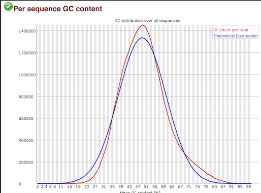
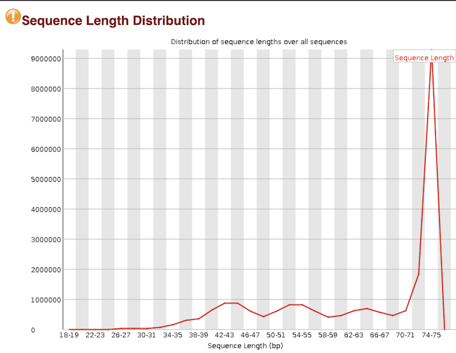
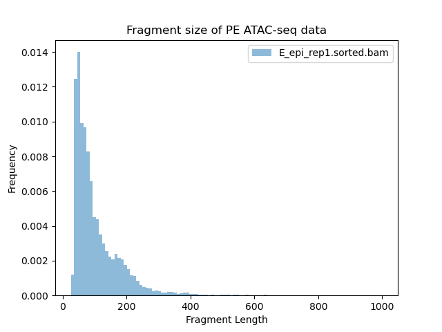
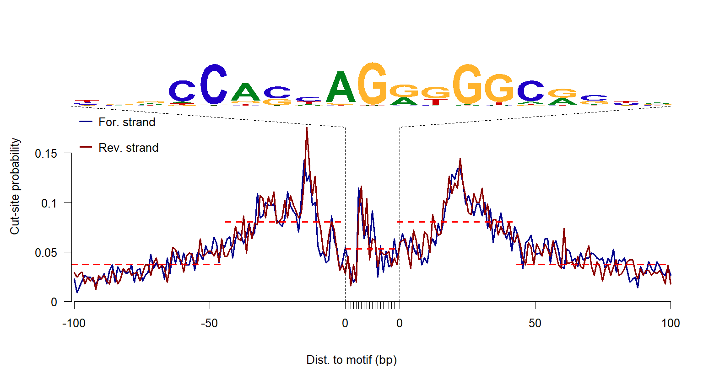
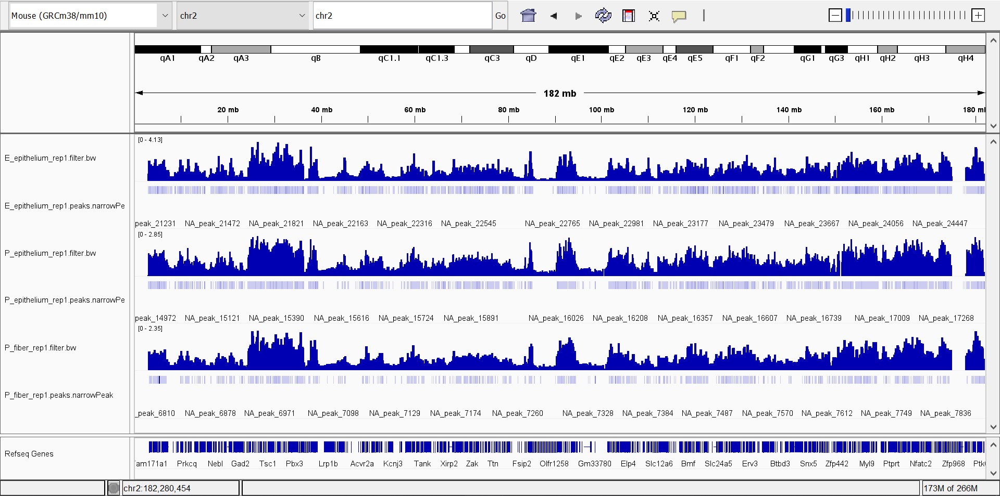
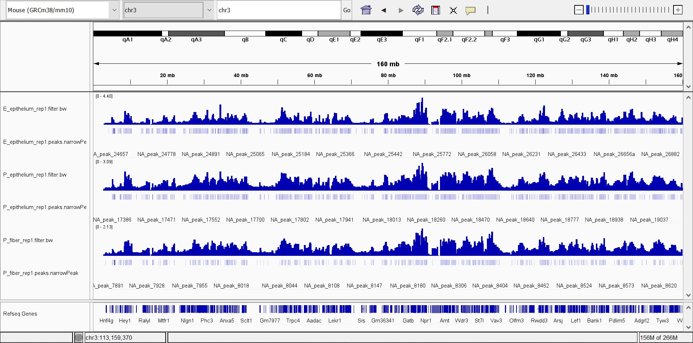
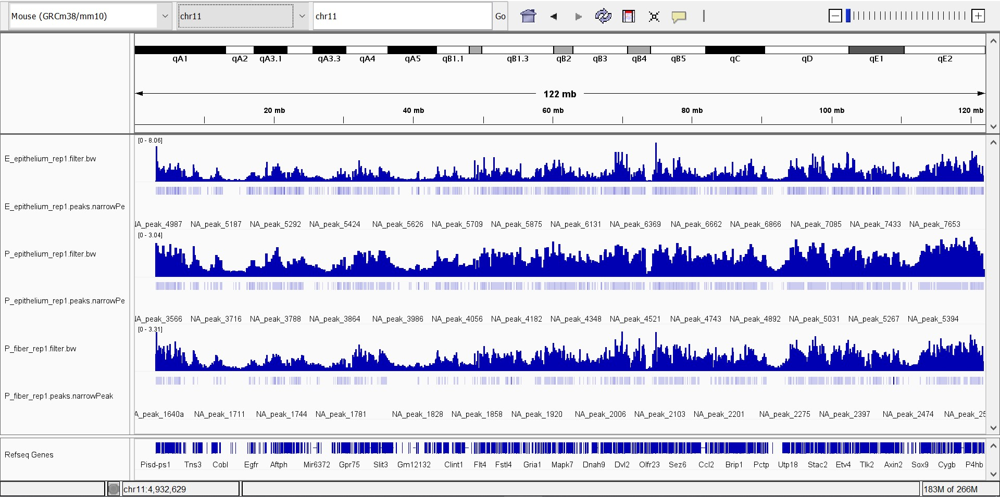
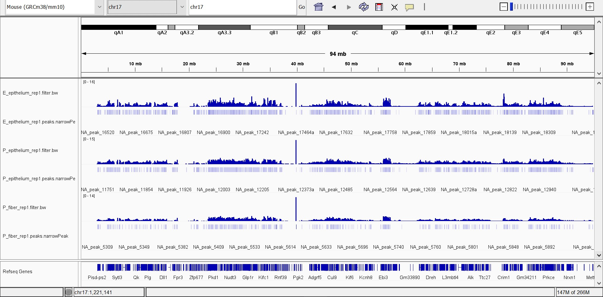
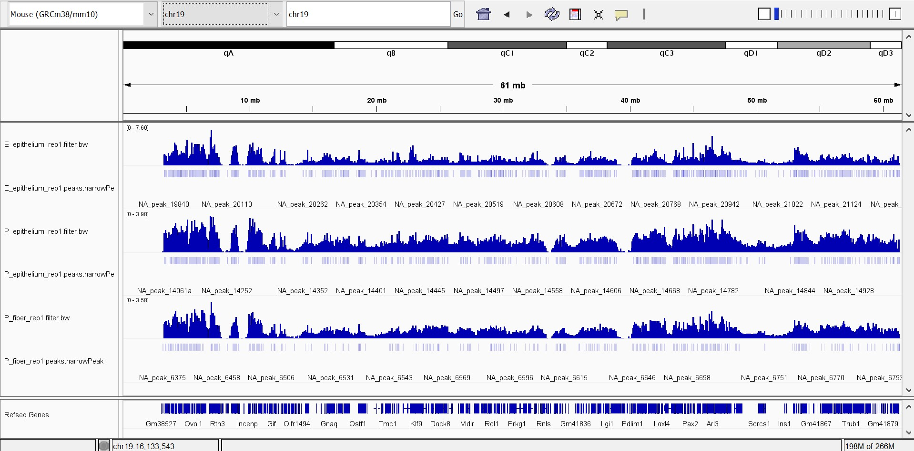
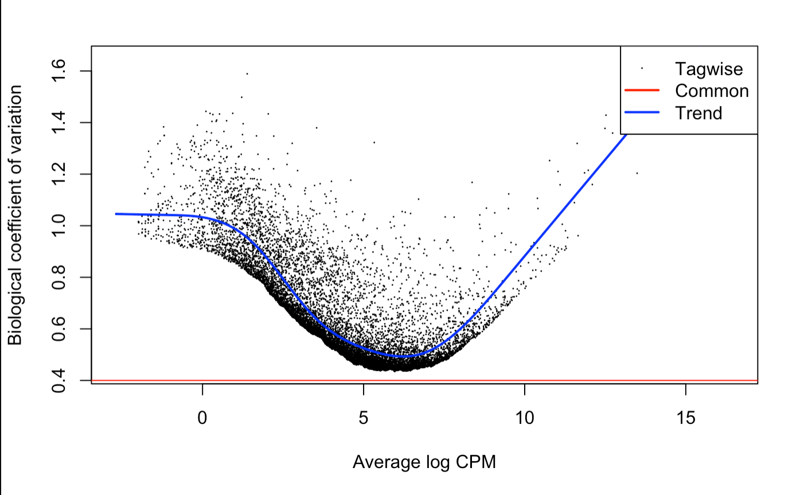

```{r setup, include=FALSE}
knitr::opts_chunk$set(echo = TRUE)
```


# Introduction

The goal of the original study was to make a chromatin accessibility map to model the general stages of chromatin changes that form lens fiber cells (lens of eye). To observe these chromatin changes, the original paper [1] analyzes active/open promoters and enhancers to find relevant cis-regulatory DNA sequences that controls specificity and quantity of transcription. Lens epithelium cells are the parental cells that can generate lens fiber cells during childhood development. Lens fiber cells are located posterior to the lens epithelium cells, and the fiber cells make up the bulk of the eye lens. ATAC-seq was used to observe chromatin changes during mouse lens fibers and epithelium differentiation. Drawing from other unbiased studies, cis-regulatory motifs that are known to be up-regulated in differentiating lens fibers were chosen and analyzed. For instance, during lens morphogenesis, transcription factor Pax6 is known to differentiate epithelial cells into fiber cells and differentiate epithelial cells into mature lens epithelium. 

The scope of this re-analysis is to verify the result of the chromatin accessibility map of lens from middle (formation of lens fibers and lens epithelium) to late (maturation of lens epithelium and lens fibers) stages of differentiation. Currently, mouse lens differentiation is the leading model for these processes, so our study will use 14.5 days old embryo cells from a mouse (E14.5) and 0.5 days old matured cells from the same mouse (P0.5). For both E14.5 and P0.5 samples, the lens epithelium and lens fiber cells will be analyzed, for a total of 4 cell samples. To ensure the correctness of our first analysis, a second analysis will be done on the same 4 cell types but on a different mouse. The sequencing was done as paired-end sequencing, so a total of 16 analysis are done (2 reads for 2 difference mice's at 2 different stages for 2 different cells).

This study was chosen to be re-analyzed because it was the first study to generate a lens chromatin accessibility map that shows the general stages of chromatin changes during transcriptional activities of lens fiber cell formation. We wanted to verify the results by attempting to reproduce the study using the same and some alternative methods. We were fascinated by the idea of creating a visualization or map of the changes in chromatin accessibility for lens formation or any kind of cells in general. We hope this study can expedite future studies on lens morphogenesis and transcriptional control regions. 

# Methods


## Acquiring Raw Data Online

The original study acquires the mouse lens samples by dissecting the mouse lens epithelium and fibers. They then follow ATAC-seq protocol by treating the samples with transposase at 37°C for 30 min to prepare for ATAC-seq analysis. The ATAC-seq library was used for 75-bp paired-end sequencing on Illumina NextSeq 500. We follow the original study and assume that 75-bp is a good base pair length, since small sequence length could result in many ambiguously mapped reads (reads map to several sites in the genome) and a long sequence length could result in finding less uniquely mapped reads. In Figure 1, the ATAC-seq data processing steps are described as a flowchart and the green boxes represent quality controls. The data was downloaded from the European Nucleotide Archive (ENA): https://www.ebi.ac.uk/ena/browser/home. 

```{bash, eval=FALSE}
#?# Obtain data from the European Nucleotide Archive

# E14.5 epithelium rep1 (SRR8380074):
wget ftp://ftp.sra.ebi.ac.uk/vol1/fastq/SRR838/004/SRR8380074/SRR8380074_1.fastq.gz
wget ftp://ftp.sra.ebi.ac.uk/vol1/fastq/SRR838/004/SRR8380074/SRR8380074_2.fastq.gz

# E14.5 epithelium rep2 (SRR8380075):
wget ftp://ftp.sra.ebi.ac.uk/vol1/fastq/SRR838/005/SRR8380075/SRR8380075_1.fastq.gz
wget ftp://ftp.sra.ebi.ac.uk/vol1/fastq/SRR838/005/SRR8380075/SRR8380075_2.fastq.gz

# E14.5 fiber rep1 (SRR8380076):
wget ftp://ftp.sra.ebi.ac.uk/vol1/fastq/SRR838/006/SRR8380076/SRR8380076_1.fastq.gz
wget ftp://ftp.sra.ebi.ac.uk/vol1/fastq/SRR838/006/SRR8380076/SRR8380076_2.fastq.gz

# E14.5 fiber rep2 (SRR8380077):
wget ftp://ftp.sra.ebi.ac.uk/vol1/fastq/SRR838/007/SRR8380077/SRR8380077_1.fastq.gz
wget ftp://ftp.sra.ebi.ac.uk/vol1/fastq/SRR838/007/SRR8380077/SRR8380077_2.fastq.gz

# P0.5 epithelium rep1 (SRR8380078):
wget ftp://ftp.sra.ebi.ac.uk/vol1/fastq/SRR838/008/SRR8380078/SRR8380078_1.fastq.gz
wget ftp://ftp.sra.ebi.ac.uk/vol1/fastq/SRR838/008/SRR8380078/SRR8380078_2.fastq.gz

# P0.5 epithelium rep2 (SRR8380079):
wget ftp://ftp.sra.ebi.ac.uk/vol1/fastq/SRR838/009/SRR8380079/SRR8380079_1.fastq.gz
wget ftp://ftp.sra.ebi.ac.uk/vol1/fastq/SRR838/009/SRR8380079/SRR8380079_2.fastq.gz

# P0.5 fiber rep1 (SRR8380080):
wget ftp://ftp.sra.ebi.ac.uk/vol1/fastq/SRR838/000/SRR8380080/SRR8380080_1.fastq.gz
wget ftp://ftp.sra.ebi.ac.uk/vol1/fastq/SRR838/000/SRR8380080/SRR8380080_2.fastq.gz

# P0.5 fiber rep2 (SRR8380081):
wget ftp://ftp.sra.ebi.ac.uk/vol1/fastq/SRR838/001/SRR8380081/SRR8380081_1.fastq.gz
wget ftp://ftp.sra.ebi.ac.uk/vol1/fastq/SRR838/001/SRR8380081/SRR8380081_2.fastq.gz

# mm10 genome:
wget https://genome-idx.s3.amazonaws.com/bt/mm10.zip

# mm10 blacklist region as .bed file from https://github.com/Boyle-Lab/Blacklist/blob/master/lists/mm10-blacklist.v2.bed.gz
wget https://github.com/Boyle-Lab/Blacklist/blob/master/lists/mm10-blacklist.v2.bed.gz?raw=true

```

### Initial Quality Control: Fast QC

Like any sequencing analysis, our first workflow step is to ensure the quality of our reads before aligning them to the reference genome. We use the FastQC library to import our reads which is in fastq format and plot their quality scores. This allows us to quickly assess our reads quality in HTML. Figure 2 shows per base sequence quality of sample SRR8380074. The plot shows that all of the reads are in good quality with phred scores above 25 (99% accuracy). The only test that failed was the per base sequence quality. We deduct this is due to transposase-5 (Tn5) sequence bias as Tn5 is used to cleave chromatin and insert sequencing adapters. To avoid redundant graphs, we only include the SRR8380074 fastqc result, but all other samples have equal or very similar qualities. Since we have good quality for our reads, we proceed to ATAC-seq analysis.

```{bash, eval=FALSE}
fastqc SRR8380074_1.fastq.gz
fastqc SRR8380074_2.fastq.gz
fastqc SRR8380075_1.fastq.gz
fastqc SRR8380075_2.fastq.gz
fastqc SRR8380076_1.fastq.gz
fastqc SRR8380076_2.fastq.gz
fastqc SRR8380077_1.fastq.gz
fastqc SRR8380077_2.fastq.gz
fastqc SRR8380078_1.fastq.gz
fastqc SRR8380078_2.fastq.gz
fastqc SRR8380079_1.fastq.gz
fastqc SRR8380079_2.fastq.gz
fastqc SRR8380080_1.fastq.gz
fastqc SRR8380080_2.fastq.gz
fastqc SRR8380081_1.fastq.gz
fastqc SRR8380081_2.fastq.gz
```







## ATAC-seq Data Analysis

The 75-bp paired-end ATAC-seq reads are trimmed by trimmomatic (v 0.39) to remove adaptors. Trimming adaptor sequences filters out low sequencing quality which helps for aligners to achieve a better read mapping result. An aligner library Bowtie2 (v 2.3.4.2) is used to map the trimmed reads to the mouse reference genome (mm10). The mapped reads are then filtered for mitochondrial, duplicated reads, and mm10 blacklist regions through SAMtools (v 1.2), picard (v 2.27.1), and bedtools2 (v 2.26.0). Mitochondrial regions are filtered out as they are common contaminant of ATAC-seq data. Then, MACS2 (v 2.1.0) is used to call and merge peaks and the peaks. Lastly, we can identify how many non-redundant ATAC-seq peaks exist in our sample.

#### Raw Data Processing

```{bash, eval=FALSE}
# Remove adapters (ILLUMINACLIP:TruSeq3-PE.fa:2:30:10)
# Remove leading low quality or N bases (below quality 3) (LEADING:3)
# Remove trailing low quality or N bases (below quality 3) (TRAILING:3)
# cut the read to a specified length (CROP:75)
# sliding window: Scan the read with a 4-base wide sliding window, cutting when the average quality per base drops below 20 (SLIDINGWINDOW:4:20)
# drop reads below the 25 bases long (MINLEN:25)

trimmomatic PE SRR8380074_1.fastq.gz SRR8380074_2.fastq.gz output_forward_paired.fq.gz output_forward_unpaired.fq.gz output_reverse_paired.fq.gz output_reverse_unpaired.fq.gz ILLUMINACLIP:anaconda3/pkgs/trimmomatic-0.39-hdfd78af_2/share/trimmomatic-0.39-2/adapters/TruSeq3-SE.fa:2:30:10 LEADING:3 TRAILING:3 CROP:75 SLIDINGWINDOW:4:20 MINLEN:25

# result:
Input Read Pairs: 22494870 Both Surviving: 19080476 (84.82%) Forward Only Surviving: 2351296 (10.45%) Reverse Only Surviving: 524423 (2.33%) Dropped: 538675 (2.39%)
TrimmomaticPE: Completed successfully

#alternative trimming method using trim_galore
#trim_galore --fastqc  -nextera --paired --length 75 -o SRR8380074 SRR8380074_1.fastq.gz SRR8380074_2.fastq.gz

# align trimmed reads to mouse genome mm10 (mm10 download instructions above)
bowtie2 -x ./mm10/mm10 -p 32 -1 output_forward_paired.fq.gz -2 output_reverse_paired.fq.gz -S E_epithelium_rep1.sam -X 2000 –-no-mixed –-no-discordant -–local

#-X: The maximum fragment length for valid paired-end alignments. 

#--no-mixed: By default, when bowtie2 cannot find a concordant or discordant alignment for a pair, it then tries to find alignments for the individual mates. This option disables that behavior.

#--no-discordant: By default, bowtie2 looks for discordant alignments if it cannot find any concordant alignments. A discordant alignment is an alignment where both mates align uniquely, but that does not satisfy the paired-end constraints (--fr/--rf/--ff, -I, -X). This option disables that behavior.

#--local: In this mode, Bowtie 2 does not require that the entire read align from one end to the other. Rather, some characters may be omitted ("soft clipped") from the ends in order to achieve the greatest possible alignment score. The match bonus --ma is used in this mode, and the best possible alignment score is equal to the match bonus (--ma) times the length of the read. Specifying --local and one of the presets (e.g. --local --very-fast) is equivalent to specifying the local version of the preset (--very-fast-local). This is mutually exclusive with --end-to-end. --end-to-end is the default mode.

# result:
19080476 reads; of these:
  19080476 (100.00%) were paired; of these:
    260808 (1.37%) aligned concordantly 0 times
    13280707 (69.60%) aligned concordantly exactly 1 time
    5538961 (29.03%) aligned concordantly >1 times
98.63% overall alignment rate

# Use sambamba view to get the number of uniquely mapped reads of the alignment output
sambamba view -c -S -F "[XS] == null and not unmapped and not duplicate" -t 32 E_epithelium_rep1.sam
# number of uniquely mapped reads of the alignment
26816203

#Remove reads with low quality score: MAPQ < 30s and convert sam to bam
samtools view -@ 32 -bSq 30 E_epithelium_rep1.sam > E_epithelium_rep1.bam

#filter out duplicated reads
#samtools sort -@ 32 -n -o Sorted_names.bam -O BAM E_epithelium_rep1.bam
#This command will sort your Alignment file based on the names of reads.
#samtools fixmate -m Sorted_names.bam fixmate.bam
#This will fill in mate coordinates and insert size fields

#Alternatively we used picard to replace the above steps
java -jar /home/bguo_bmeg22/anaconda3/pkgs/picard-2.27.1-hdfd78af_0/share/picard-2.27.1-0/picard.jar FixMateInformation -I E_epithelium_rep1.bam -O fixed_mate.bam -ADD_MATE_CIGAR true
#Verify mate-pair information between mates and fix if needed.This tool ensures that all mate-pair information is in sync between each read and its mate pair.
samtools sort -@ 32 -o positionsort.bam fixed_mate.bam
#This will sort based on chromosome number and coordinates 
samtools rmdup -sS positionsort.bam E_epi_rep1.bam
#This will remove all the duplicates and also print some basic stats about the result file

#-r: Remove duplicate reads

#alternative duplicates removal method using picard
#java -jar /home/bguo_bmeg22/anaconda3/pkgs/picard-2.27.1-hdfd78af_0/share/picard-2.27.1-0/picard.jar MarkDuplicates -I E_epithelium_rep1.bam -O E_epi_rep1x.bam -M 74marked_dup_metrics.txt -REMOVE_DUPLICATES true -VALIDATION_STRINGENCY SILENT

#Index the bam file
samtools index E_epi_rep1.bam

#filter out mitochondrial reads 
samtools idxstats E_epi_rep1.bam | cut -f 1 | grep -v MT | xargs samtools view -b E_epi_rep1.bam > E_epi_rep1.sorted.bam
#alternative method using samtools view
#samtools view -@ 32 -h E_epi_rep1.bam | grep -v chrM | samtools view -@ 32 -b -h -f 0x2 - | samtools sort -> E_epi_rep1.sorted.bam

#Index the bam file
samtools index E_epi_rep1.sorted.bam

```

### Quality Control: Deeptools Fragment Size

We then do quality control on our SAM/BAM files by calculating the fragment sizes. This is because the fragment size is very sensitive to the concentration of the sample's DNA and the variation of fragment sizes is often large. Since alignment libraries like bowtie2 uses overlapping paired end reads to produce longer continuous sequences (75 bp + ~100 unsequenced bp + 75 bp). Small fragment sizes would mean fewer long reads which could result in the presence of adapter at the end of the read despite trimming. We can use bamPEFragmentSize to check if our paired-end samples have fragment sizes long enough for this possibility to be minimized. This module in particular summarizes the statistic of the reads. Drawing from the results below, our framgment length had a mean of 105.65 bp, which is about the same size of our unsequenced bp. This shows that the adapter regions have been successfully trimmed and therefore passes the quality check. Our calculated TSS score was 13.7, which is above the ideal condition of TSS score 7, hence passes our quality check.

```{bash, eval=FALSE}
#Calculate the fragment size distribution using deeptools
bamPEFragmentSize -hist fragmentSize.png -T "Fragment size of PE ATAC-seq data" --maxFragmentLength 1000 -b E_epi_rep1.sorted.bam 

result:
BAM file : E_epi_rep1.sorted.bam
Sample size: 13262

Fragment lengths:
Min.: 26.0
1st Qu.: 54.0
Mean: 105.65133464032574
Median: 79.0
3rd Qu.: 132.0
Max.: 1339.0
Std: 78.51122531031345
MAD: 30.0
Len. 10%: 44.0
Len. 20%: 51.0
Len. 30%: 58.0
Len. 40%: 67.40000000000055
Len. 60%: 94.0
Len. 70%: 115.0
Len. 80%: 152.0
Len. 90%: 199.89999999999964
Len. 99%: 393.77999999999884


Read lengths:
Sample size: 13262

Min.: 25.0
1st Qu.: 52.0
Mean: 63.14960036193636
Median: 72.0
3rd Qu.: 75.0
Max.: 75.0
Std: 13.685104993903321
MAD: 3.0
Len. 10%: 42.0
Len. 20%: 48.0
Len. 30%: 55.0
Len. 40%: 63.0
Len. 60%: 74.0
Len. 70%: 74.0
Len. 80%: 75.0
Len. 90%: 75.0
Len. 99%: 75.0

```



### Quality Control: TSS Enrichment

Transcription Start Site (TSS) Enrichment Score is a signal to noise ratio used to evaluate ATAC-seq. The signal (desired signal) represents the combined distributions of reads centered on the reference TSSs and the noise (background noise) represents the distributions of reads flanking/next to the reference TSSs. A typical TSS score vs distance to TSS plot would have a peak in the middle with high TSS scores at transcription start sites (highly open regions of the genome) [3]. The center signal value is our TSS enrichment metric used to evaluate ATAC-seq. Additionally, we split the reads into nucleosome free, mononucleosome, dinucleosome, and trinucleosome and discard the rest, as these reads are most usable and unbiased for interpreting functional dynamic of nucleosomes.

```{bash, eval=FALSE}
# Calculation of TSS Scores for ATAC-seq Data
# required package: conda install -c bioconda subread
# 1.Download mm10 annotation file. 
# get mm10 refSeq annotations
wget -qO- http://hgdownload.cse.ucsc.edu/goldenPath/mm10/database/refGene.txt.gz | gunzip -c - | awk 'BEGIN{ OFS="\t" }{ print $3, $5, $6, $13, $10, $4  }' - | sort-bed - > refGene.bed

# 2.Define and extract TSS regions (1000 bp +/- TSS)
# Split them by strand and pad around the stranded-start position of the annotation (Take areas around TSS -/+ 1000)
awk '($6 == "+") { print $0 }' refGene.bed | awk 'BEGIN{ OFS="\t" }($2 > 1000){ print $1, ($2 - 1000), ($2 + 1000), $4, $5, $6  }' > refGene.tss.for.padded.bed
awk '($6 == "-") { print $0 }' refGene.bed | awk 'BEGIN{ OFS="\t" }($3 > 1000){ print $1, ($3 - 1000), ($3 + 1000), $4, $5, $6  }' > refGene.tss.rev.padded.bed

bedops --everything refGene.tss.for.padded.bed refGene.tss.rev.padded.bed > refGene.tss.padded.bed

# 3.Check that the defined TSS regions do not extend outside chromosomal bounds. 
# Keep only TSS regions within chromosomal bounds.
fetchChromSizes mm10 | awk '{ print $1"\t0\t"$2; }' | sort-bed - > mm10.bounds.bed
bedops --element-of 100% refGene.tss.padded.bed mm10.bounds.bed > refGene.tss.padded.filtered.bed

# 4.Convert the file to SAF file format.
# Convert to SAF
awk 'BEGIN{FS=OFS="\t"; print "GeneID\tChr\tStart\tEnd\tStrand"}{print $4, $1, $2+1, $3, "."}' refGene.tss.padded.filtered.bed > refGene.tss.padded.filtered.bed.saf

# 5.Use featureCounts to counts reads aligned to the defined TSS regions (Signal).
# Count reads using FeatureCounts.

featureCounts -T 6 -a refGene.tss.padded.filtered.bed.saf -F SAF -o readCountInPeaks.txt E_epithelium_rep1_sorted.bam
# Record number of successful alignments to the TSS

#Part 2
#Repeat the same procedure on different regions (100bp -/+ of TSS regions)
# Use the same file for the TSS regions and use flank from bedtools to get these 100bp -/+ regions (with the exclusion of the TSS region). Flank tool requires a genome file (different from the one used to get the TSS) to get the 100bp -/+. First, we need a genome file defining the length of each chromosome or contig.
#download mm10 genome fastq file
wget http://hgdownload.cse.ucsc.edu/goldenPath/mm10/bigZips/mm10.fa.gz 
gzip -d mm10.fa.gz
samtools faidx mm10.fa 
cut -f 1,2 mm10.fa.fai > chrom.sizes 

# 6.Define a 100 bp +/- flanking regions at the edges of the TSS regions made in step 3.
# Use flank from bedtools

bedtools flank -i refGene.tss.padded.filtered.bed -g chrom.sizes -b 100 > Flanks_100_up_down.bed

# 7.Convert the file to SAF file format.

awk 'BEGIN{FS=OFS="\t"; print "GeneID\tChr\tStart\tEnd\tStrand"}{print $4, $1, $2+1, $3, "."}' Flanks_100_up_down.bed > Flanks_100_up_down.bed.saf

# 8.Use featureCounts to counts reads aligned to the defined 100 bp +/- flanking regions at the edges of the TSS regions (Background/Noise).

featureCounts -T 6 -a Flanks_100_up_down.bed.saf -F SAF -o readCountInPeaks.txt E_epithelium_rep1_sorted.bam

# 9. Divide reads from signal by reads from (Background/Noise) to calculate the fold change

#To get TSS Enrichemnt score Divide total number of successful alignments to the TSS by total number of successful alignments to the 100bp -/+

4674762/341898

#Transcription start site (TSS) enrichment values are dependent on the reference files used; cutoff values for high quality data are listed below.

#GRCh38 Refseq TSS annotation

#below 5 Concerning
#5 - 7 Acceptable
#Above 7 Ideal

# As a result, the calculated TSS score is 13.67297 which is in the ideal condition

```


### Quality Control: ATACseqQC

Alternatively, we can calculate the TSS enrichment score (the degree to which transcription start sites show enrichment for ATAC-seq reads) using ATACseqQC. Using ATACseqQC gives us a more hollistic overview of our data because we can get additional information such as the library complexity, nucleosome positioning, PT score, and NFR score. 

```{r, eval=FALSE}
#Load library
#BiocManager::install(c("ATACseqQC", "TxDb.Mmusculus.UCSC.mm10.knownGene", "BSgenome.Mmusculus.UCSC.mm10", "GenomicScores", "ChIPpeakAnno", "MotifDb", "GenomicAlignments"))

library(ATACseqQC)
library(Rsamtools)
library(TxDb.Mmusculus.UCSC.mm10.knownGene)
library(BSgenome.Mmusculus.UCSC.mm10)
library(GenomicScores)
library(ChIPpeakAnno)
library(MotifDb)
library(GenomicAlignments)

## input the bamFile
bamfile <- "E_epithelium_rep1_sorted.bam"
bambai_idx <- "E_epithelium_rep1_sorted.bam.bai"
bam <-scanBam("E_epithelium_rep1_sorted.bam")
bamfile.labels <- gsub(".bam", "", basename(bamfile))

#IGV snapshot
source(system.file("extdata", "IGVSnapshot.R", package = "ATACseqQC"))

#Estimate the library complexity
##bamQC(bamfile, outPath=NULL)
estimateLibComplexity(readsDupFreq(bamfile, index=bambai_idx))
```
#### Library Complexity
The library complexity is the number of unique DNA fragments present in our bam file. A small complexity, which typically results from PCR amplification, will counteract against downstream analysis because the number of duplicate reads is too high. Additionally, the nucleosome positioning is important for downstream analysis, because downstream analysis requires peak-called reads in bamfiles to be shifted. This is because Tn5 transposase inserts two adaptors into accessible DNA locations separated by 9 bp. From our results below, our library complexity shows a cumulative distribution when plotting putative sequence fragments against distinct fragments. Since high reads indicate distinct fragments, this passes our quality check. 

```{r, eval=FALSE}
#Fragment size distribution
## generate fragement size distribution
fragSize <- fragSizeDist(bamfile, bamfile.labels)
```
```{r, eval=FALSE}
#Nucleosome positioning
#Adjust the read start sites
## bamfile tags to be read in
possibleTag <- list("integer"=c("AM", "AS", "CM", "CP", "FI", "H0", "H1", "H2", "HI", "IH", "MQ", "NH", "NM", "OP", "PQ", "SM", "TC", "UQ"), "character"=c("BC", "BQ", "BZ", "CB", "CC", "CO", "CQ", "CR", "CS", "CT", "CY", "E2", "FS", "LB", "MC", "MD", "MI", "OA", "OC", "OQ", "OX", "PG", "PT", "PU", "Q2", "QT", "QX", "R2", "RG", "RX", "SA", "TS", "U2"))

bamTop100 <- scanBam(BamFile(bamfile, yieldSize = 100),
                     param = ScanBamParam(tag=unlist(possibleTag)))[[1]]$tag
tags <- names(bamTop100)[lengths(bamTop100)>0]
tags
## files will be output into outPath
outPath <- "splited"
dir.create(outPath)
## shift the coordinates of 5'ends of alignments in the bam file

seqlev <- "chr1" ## subsample data for quick run
seqinformation <- seqinfo(TxDb.Mmusculus.UCSC.mm10.knownGene)
which <- as(seqinformation[seqlev], "GRanges")
gal <- readBamFile(bamfile, tag=tags, which=which, asMates=TRUE, bigFile=TRUE)
shiftedBamfile <- file.path(outPath, "shifted.bam")

gal1 <- shiftGAlignmentsList(gal, outbam=shiftedBamfile)

# Promoter/Transcript body (PT) score
txs <- transcripts(TxDb.Mmusculus.UCSC.mm10.knownGene)
pt <- PTscore(gal1, txs)
plot(pt$log2meanCoverage, pt$PT_score, 
     xlab="log2 mean coverage",
     ylab="Promoter vs Transcript")
```
#### Promoter/Transcript body score (PT Score)

The PT score calculates the coverage of promoter divided by the coverage of its transcript body. The PT score shows if the signal is enriched in promoters. The promoter sequences dictates where the transcription of DNA sequences starts. The log2 mean coverage depth is an average of coverage depths for the corresponding bin at each sample. A positive PT score (y-axis) indicates a transcript region, and a negative PT score indicates a promoter region. Since the coverage for these values appear symmetric, our data passes the PT quality check since promoter sequences are expected to be very near the transcript body.


```{r, eval=FALSE}
#Nucleosome Free Regions (NFR) score
nfr <- NFRscore(gal1, txs)
plot(nfr$log2meanCoverage, nfr$NFR_score, 
     xlab="log2 mean coverage",
     ylab="Nucleosome Free Regions score",
     main="NFRscore for 200bp flanking TSSs",
     xlim=c(-10, 0), ylim=c(-5, 5))
```
#### Nucleosome Free Regions (NFR) score

NFR score is a ratio between TSS and its flanking TSS signals. The NFR score for each TSS is log2(nf) - log2((n1+n2)/2) where n1 is the most upstream 150 bp, n2 is the most downstream of 150 bp, and nf is the middle 100 bp. Comparing our NFT plot to the PT plot, we see similar coverage and the NFR score is subdivided into subregions as expected. The NFR plot is meant to reflect similarly to the MA plot for gene expression data, and our plot reflects the same result. Hence, our data passes the NFR quality check. 


```{r, eval=FALSE}
#Transcription Start Site (TSS) Enrichment Score
tsse <- TSSEscore(gal1, txs)
tsse$TSSEscore
plot(100*(-9:10-.5), tsse$values, type="b", 
     xlab="distance to TSS",
     ylab="aggregate TSS score")

```
#### TSS Enrichment Score

As already calculated from above, we know that our TSS score is in ideal condition. However, ATACseqQC library allows us to view the full distribution of our TSS scores. This distribution takes the signal value at the center of the distribution after TSS normalization as our TSS metric. Since the flanking TSS scores drop away from the peak, our data reflects the quality check as expected. 


```{r, eval=FALSE}
#Split reads into nucleosome free, mononucleosome, dinucleosome, and trinucleosome (and discard the rest)
## run program for chromosome 1 only
txs <- txs[seqnames(txs) %in% "chr1"]
genome <- Mmusculus
## split the reads into NucleosomeFree, mononucleosome, 
## dinucleosome and trinucleosome.
## and save the binned alignments into bam files.
phastCons60way.UCSC.mm10 <- getGScores("phastCons60way.UCSC.mm10")
objs <- splitGAlignmentsByCut(gal1, txs=txs, genome=genome, outPath = outPath, conservation=phastCons60way.UCSC.mm10)
## list the files generated by splitGAlignmentsByCut.
dir(outPath)

# alternative: can also perform shifting, splitting and saving in one step by calling splitBam.
#objs <- splitBam(bamfile, tags=tags, outPath=outPath,txs=txs, genome=genome, conservation=phastCons60way.UCSC.mm10)

#Conservation is an optional parameter. Use this code if there is no conservation score or it only needs to simply split the bam files by the fragment length, which will run much faster.
## split reads by fragment length
## NOT RUN IN THIS example
#objs <- splitGAlignmentsByCut(gal1, txs=txs, outPath = outPath)

#Heatmap and coverage curve for nucleosome positions
bamfiles <- file.path(outPath,
                     c("NucleosomeFree.bam",
                     "mononucleosome.bam",
                     "dinucleosome.bam",
                     "trinucleosome.bam"))
## Plot the cumulative percentage of tag allocation in nucleosome-free 
## and mononucleosome bam files.
cumulativePercentage(bamfiles[1:2], as(seqinformation["chr1"], "GRanges"))
```
#### Heatmap and Coverage Curve for Nucleosome Positions

A normal coverage curve for mononucleosome positions would have a high peak at 0.99 and a sharp drop anything below 0.99. A normal heatmap would have heavy concentration at the middle region of the nucleosome free heatmap and almost no/equal signals of low concentration for the mononucleosome heatmap. This is because we enriched nucleosome-free fragments at the TSS region, so we should observe a conentration of signals near the TSS region (near the middle region of the nucleosome free heatmap). We expect this since we averaged the signals across all active TSSs. For the mononucleosome heatmap, we enriched both upstream and downstream of the active TSSs so it should display almost no/equal signals of low concentration everywhere. Since our heatmap matches both descriptions, it passes our quality check. Additinoally for the coverage curve for nucleosome positions, because ATAC-seq reads are concentrated at regions of open chromatin, we should see a strong nucleosome signal at the +1 nucleosome. We also see that for our coverage curve for nucleosome positions, hence our data passes the quality check.


```{r, eval=FALSE}
TSS <- promoters(txs, upstream=0, downstream=1)
TSS <- unique(TSS)
## estimate the library size for normalization
(librarySize <- estLibSize(bamfiles))

## calculate the signals around TSSs.
NTILE <- 101
dws <- ups <- 1010
sigs <- enrichedFragments(gal=objs[c("NucleosomeFree", 
                                     "mononucleosome",
                                     "dinucleosome",
                                     "trinucleosome")], 
                          TSS=TSS,
                          librarySize=librarySize,
                          seqlev=seqlev,
                          TSS.filter=0.5,
                          n.tile = NTILE,
                          upstream = ups,
                          downstream = dws)
## log2 transformed signals
sigs.log2 <- lapply(sigs, function(.ele) log2(.ele+1))
#plot heatmap
featureAlignedHeatmap(sigs.log2, reCenterPeaks(TSS, width=ups+dws),
                      zeroAt=.5, n.tile=NTILE)
```

```{r, eval=FALSE}
## get signals normalized for nucleosome-free and nucleosome-bound regions.
out <- featureAlignedDistribution(sigs, reCenterPeaks(TSS, width=ups+dws),zeroAt=.5, n.tile=NTILE, type="l", ylab="Averaged coverage")

## rescale the nucleosome-free and nucleosome signals to 0~1
range01 <- function(x){(x-min(x))/(max(x)-min(x))}
out <- apply(out, 2, range01)
matplot(out, type="l", xaxt="n", 
        xlab="Position (bp)", 
        ylab="Fraction of signal")
axis(1, at=seq(0, 100, by=10)+1, 
     labels=c("-1K", seq(-800, 800, by=200), "1K"), las=2)
abline(v=seq(0, 100, by=10)+1, lty=2, col="gray")
```

```{r, eval=FALSE}
#plot Footprints
## foot prints
CTCF <- query(MotifDb, c("CTCF"))
CTCF <- as.list(CTCF)
print(CTCF[[1]], digits=2)

sigs <- factorFootprints(shiftedBamfile, pfm=CTCF[[1]], 
                         genome=genome, 
                         min.score="90%", seqlev=seqlev,
                         upstream=100, downstream=100)
```
#### Plot Footprints and Feature Aligned Heatmap

The factorFootprints function predicts the binding sites using the input position weight matrix (PWM) to calculate and plot the accumulated coverage of those binding sites. It shows the status of the occupancy genome-wide, which is important since ATAC-seq footprints are factor occpupancy genome-wide (fraction of time for which a location is occupied by). The cut-site probability is very low when distance to motif is almost 0. This plot is a straightforward visualization of the characteristics of our sample.  


```{r, eval=FALSE}
featureAlignedHeatmap(sigs$signal, 
                      feature.gr=reCenterPeaks(sigs$bindingSites,
                     width=200+width(sigs$bindingSites[1])), 
                      annoMcols="score",
                      sortBy="score",
                      n.tile=ncol(sigs$signal[[1]]))
```

```{r, eval=FALSE}
sigs$spearman.correlation
sigs$Profile.segmentation
```

```{r, eval=FALSE}
#V-plot
vp <- vPlot(shiftedBamfile, pfm=CTCF[[1]], 
            genome=genome, min.score="90%", seqlev=seqlev,
            upstream=200, downstream=200, 
            ylim=c(30, 250), bandwidth=c(2, 1))
```
#### V-plot

V-plot is a plot that visualizes fragment midpoint vs length for a given transcription factors. Since our sample represents a sampling distribution, the distinction of the V is barely visible. The true population dataset would show a much more distinct V shape in the plot which reveals chromatin features of transcription binding sites. The dots represent the midpoint of each paired-end fragment. The Y-axis represents its length and the x-axis represents the distance of its midpoint from the center of the genomic feature. The V-shape comes from the left diagonal line which is the fragments cleaved precisely to the right of the transcription-protected region (chromatin closed regions). The vice versa is also true, which gives this left and right diagonal shape to form a V.


```{r, eval=FALSE}
distanceDyad(vp, pch=20, cex=.5)
```

```{r, eval=FALSE}
#Plot correlations for multiple samples
pth <- "C:/Users/HYG/Desktop/BMEG 400E/BMEG-400E-Assignments/Project"
bamfiles <- dir(pth, "*.bam$", full.name=TRUE)
gals <- lapply(bamfiles, function(bamfile){
               readBamFile(bamFile=bamfile, tag=character(0), 
                          which=GRanges("chr1", IRanges(1, 1e6)), 
                          asMates=FALSE)})

txs <- transcripts(TxDb.Mmusculus.UCSC.mm10.knownGene)
plotCorrelation(GAlignmentsList(gals), txs, seqlev="chr1")


```


## Analysis Continues: Calling Peaks

After all quality checks are done, we call the peaks on our reads to identify areas that have been enriched with aligned reads. 

```{bash, eval=FALSE}
# Call peaks using macs2
macs2 callpeak -t E_epi_rep1.sorted.bam -f BAMPE -g mm -q 0.05 --outdir E_epi_rep1 --shift -75 --extsize 150 --call-summits --keep-dup all

#-f: format of input file; Default is “AUTO” which will allow MACS to decide the format automatically

#-g: mappable genome size which is defined as the genome size which can be sequenced; some precompiled values provided

#-q: q-value (minimum FDR) cutoff

#sort bed files
cd E_epi_rep1
sort -k1,1 -k2,2n NA_summits.bed > E_epi_rep1.sorted.bed
#sort the input by chromosome and then by start coordinate.
#-k, --key=KEYDEF sort via a key; KEYDEF gives location and type

#merge peaks
bedtools merge -d 10 -i E_epi_rep1.sorted.bed
#-d	Maximum distance between features allowed for features to be merged. Default is 0. That is, overlapping and/or book-ended features are merged

#Move all narrowPeaks files in one folder
#identify reproducible peaks with the 'idr' function
#required package: conda install -c bioconda idr
idr --samples E_epithelium_rep1.narrowPeak E_epithelium_rep2.narrowPeak --input-file-type narrowPeak --output-file E_epithelium.narrowPeak.bed --plot

#The output file contains the scaled IDR value (min(int(-125*log2(IDR), 1000)). If one wants to choose 0.05 as the IDR threshold to identify "reproducible" peaks, this metric must be at least 540.
awk '$5 >= 540 {print $0}' E_epithelium.narrowPeak.bed > E_epithelium.narrowPeak.filtered.bed

# filter out mm10 blacklisted regions
bedtools intersect -v -a mapped_e14_epithelium.bed -b mm10-blacklist.v2.bed > mapped_and_filtered_e14_epithelium.bam

```

### Quality Control After Calling Peaks: FriP score

Fraction of reads in peaks (FRiP) is a ratio of usable reads in significantly enriched peaks to all usable reads. In other words, it is a fraction of mapped reads that fall into the called peak region [3]. FRiP scores are often used as a measure of ChIP-seq quality. A high FriP score is benefitial since that means we have a lot of usable reads.

```{bash, eval=FALSE}
#Assessing Peak Calls by calculating the FRiP score
# 1. Preparation
## convert BAM (BAM used to call peaks) to BED
bedtools bamtobed -i P_fiber_rep2.filtered.sorted.bam | awk 'BEGIN{OFS="\t"}{$4="N";$5="1000";print $0}' > P_fiber_rep2.filtered.sorted.PE2SE.tagAlign

# 2. Total reads in BAM/BED
samtools view -c P_fiber_rep2.filtered.sorted.PE2SE.tagAlign

# 3. Count reads in peak regions

## 3.1 tagAlign, intersectBed -a tagAlign -b bed
time bedtools sort -i P_fiber_rep2.peaks.narrowPeak | bedtools merge -i stdin | bedtools intersect -u -a P_fiber_rep2.filtered.sorted.PE2SE.tagAlign -b stdin | wc -l

## 3.2 tagAlign, intersectBed -a bed -b tagAlign
time bedtools sort -i P_fiber_rep2.peaks.narrowPeak |bedtools merge -i stdin | bedtools intersect -c -a stdin -b P_fiber_rep2.filtered.sorted.PE2SE.tagAlign | awk '{{ sum+=$4 }} END {{ print sum }}'

## 3.3 BAM, intersectBed -a bam -b bed
time bedtools sort -i P_fiber_rep2.peaks.narrowPeak | bedtools merge -i stdin | bedtools intersect -u -a P_fiber_rep2.filtered.sorted.bam -b stdin -ubam | samtools view -c

## 3.5 featureCounts

### covert BED (the peaks) to SAF
awk 'BEGIN{FS=OFS="\t"; print "GeneID\tChr\tStart\tEnd\tStrand"}{print $4, $1, $2+1, $3, "."}' P_fiber_rep2.peaks.narrowPeak > P_fiber_rep2.peaks.saf

### count
featureCounts -p -a P_fiber_rep2.peaks.saf -F SAF -o readCountInPeaks.txt P_fiber_rep2.filtered.sorted.bam

```

### Quality Control: ATAQV

ATAQV is used for ATAC-seq quality control and visualization. It is a tool for comparing ATAC-seq results by finding differences that may have been caused by library prep or sequencing. Some useful metrics include mapping quality, reads napped in proper pairs, PCR duplicates, and reads mapping to mitochondrial references. We use this tool to summarize all these quality control results into a interactive HTML page, which allows the reader to view multiple samples together.

```{bash, eval=FALSE}
#ataqv summarizes QC results into an interactive html page
# required package: conda install -c bioconda ataqv
#download mm10 tss bed file
wget http://reftss.clst.riken.jp/datafiles/current/mouse/refTSS_v3.3_mouse_coordinate.mm10.bed.gz

ataqv --peak-file P_fiber_rep2.summits.bed --name P_fiber_rep2 --metrics-file P_fiber_rep2.ataqv.json.gz --excluded-region-file mm10-blacklist.v2.bed --tss-file refTSS_v3.3_mouse_coordinate.mm10.bed.gz --ignore-read-groups mouse P_fiber_rep2.bam > P_fiber_rep2.ataqv.out

# --peak-file: peak file in bed format
# --tss-file: tss in bed format
# --excluded-region-file A bed file containing excluded regions, in this case, we exclude the regions in the ENCODE blast list
# --metrics-file: output in json format
# --ignore-read-groups: Even if read groups are present in the BAM file, ignore them and combine metrics for all reads under a single sample and library named with the --name option. This also implies that a single peak file will be used for all reads.

#Run mkarv on the JSON files to generate the interactive web viewer.
mkarv P_fiber_rep2 P_fiber_rep2.ataqv.json.gz
# This code will create a folder named as P_fiber_rep2, and the index.html contains the interactive plots. 

# For multiple samples, we can combine them into a single report. In this case, both P_fiber_rep1 and P_fiber_rep2 will be in the same plots inside folder called "P_fiber"
mkarv P_fiber P_fiber_rep1.ataqv.json.gz P_fiber_rep2.ataqv.json.gz 

```

## Peak annotation

```{bash, eval=FALSE}
# use BEDOPS bedmap and gff2bed to map annotations from the reference genome to ATAC-seq peaks
bedmap --echo --echo-map E_epithelium_rep1.summits.bed <(gff2bed < genomic.gff) > E_epithelium_rep1.annotated.bed

#alternatively we can also annotate the peaks with a coordinate-description file (not used in this case)
#closestBED -a peaks.bed -b refTSS_v3.3_mouse_coordinate.mm10.bed.gz
```


## Data visualization

The University of California Santa Cruz (UCSC) genome browser (genome.ucsc.edu) is a web-based tool for annotating regions of genomes, or in our case for annotating peaks. Our peaks were associated with genes in the Refseq annotation downloaded from the UCSC genome browser. The peaks were annotated with default parameters (-3kb to +3kb from TSS). Then, Integrative Genomics Viewer (IGV, v 2.4.7) was used to visualize our annotated ATAC-seq peaks. The data was normalized to the same sequencing depth and deepTools2 (v 2.5.2) was used to plot the heat maps to show signals around peak regions with default parameters. The HTseq (ver 0.8.0) library was used to calculated read pair numbers for each peak and the EdgeR (v 3.22.3) library was used to identify differentially acecssible regions (DARs) with the cutoff CPM>2, FC>2, and FDR<0.05. We should note that a peak could be present in multiple DARs if its signal changes met this criterion Lastly, four clusters were selected from the unique and shared peaks using bedtools (v 2.23.0) to delineate unique peaks from each cell type and age. 


```{bash, eval=FALSE}

#Normalize bedtools gene coverage by RPKM and convert bam files to bigwig files
bamCoverage -b E_epithelium_rep1.filter.bam -o E_epithelium_rep1.filter.bw --binSize 10 --normalizeUsing RPKM --effectiveGenomeSize 2730871774 --ignoreForNormalization chrX --extendReads

## The deepTools ** computeMatrix reference-point ** command calculates scores to represent the reads mapping to specified regions of the genome across different files. 
## Use computeMatrix to compute a matrix for the signal tracks for each histone modification outlined above (which we will use to create a plot in the following step), with the following criteria: 

## - We will use the regions in reference_genes.bed located under the /projects/bmeg/A5/ directory as the basis for the plot.
## - Include the surrounding 1kb
## - Use all 3 input-normalized bigWig files (H3K4me3, H3K27ac, H3K27me3) as signal tracks
#?# Write the command you used to run it below: - 1.5 pt

computeMatrix reference-point -S .bw /projects/bmeg/A5/H3K27me3_norm.bw /projects/bmeg/A5/H3K27ac_norm.bw -R /projects/bmeg/A5/reference_genes.bed -o matrix -a 1000 -b 1000  

plotHeatmap -m matrix -out Heatmap --colorMap Blues --hclust 3

```

### IGV comparison between E_epithelium_rep1, P_epithelium_rep1 and P_fiber_rep1 data











### Differential Expression of Genes

Genes with larger average expression have on average larger observed variances across samples. This means the genes have different scatter because the genes with larger average expression vary in expression from sample to sample more than genes with lower average expression. We can observe this relationship from the figures below, but we should note that the logarithmic transformations creates a margin of error by over-adjusting so that large log-counts have smaller scatter than small log-counts. Additionally, scatter tends to get smaller as we increase the number of replicates. This is because standard deviations of averages are smaller than standard deviations of individual observations. Hence, if we were to have more replicates than our current amount of 2, then we would produce more accurate estimates of group means. 

```{r, eval=FALSE}

countMatrix = read.delim("seq_processed_data.txt")
rownames(countMatrix) = countMatrix[,1]
countMatrix = countMatrix[,-1]

# samples in countMatrix_rep1 are E14.5epi.rep1, E14.5fiber.rep1, P0.5epi.rep1, P0.5fiber.rep1
countMatrix_rep1 = countMatrix[,c(1,4,19,22)]
samples_rep1 = names(countMatrix_rep1)
dge1 <- DGEList(counts=countMatrix_rep1, group=samples_rep1)
# Normalize by total count (dgeR uses TMM normalization)
dge1 <- calcNormFactors(dge1)
# Create the contrast matrix: specifying the samples we want to compare with another
# the design matrix is a 0/1 matrix where each col is a sample and each row is different gene. 1 in the matrix indicates that the sample contains that gene. 0 indicates that the sample does not contain that gene. 
design.mat1 <- model.matrix(~ 0 + dge1$samples$group)

dge1$samples
dge1$samples$group

colnames(design.mat1) <- levels(dge1$samples$group)
# Estimate dispersion parameter for GLM to get the average dispersion between the samples
dge1 <- estimateGLMCommonDisp(dge1, design.mat1)
# creating trend line
dge1 <- estimateGLMTrendedDisp(dge1, design.mat1, method = "power")
# tags = genes, creating tagwise dispersion parameter
dge1 <- estimateGLMTagwiseDisp(dge1, design.mat1)

# repeat for replicate 2
# samples in countMatrix_rep2 are E14.5epi.rep2, E14.5fiber.rep2, P0.5epi.rep2, P0.5fiber.rep2
countMatrix_rep2 = countMatrix[,c(2,5,20,23)]
samples_rep2 = names(countMatrix_rep2)
dge2 <- DGEList(counts=countMatrix_rep2, group=samples_rep2)
dge2 <- calcNormFactors(dge2)
design.mat2 <- model.matrix(~ 0 + dge2$samples$group)
colnames(design.mat2) <- levels(dge2$samples$group)
dge2 <- estimateGLMCommonDisp(dge2, design.mat2)
dge2 <- estimateGLMTrendedDisp(dge2, design.mat2, method = "power")
dge2 <- estimateGLMTagwiseDisp(dge2, design.mat2)

plotBCV(dge1)
plotBCV(dge2)
```




To gain a better understanding of the variance of our selected genes, we plot mean vs variance here as the average log CPM is the mean expression value plotted against the coefficient of variation. In the code above using edgeR, a common dispersion is estimated for all the tags and then the tagwise dispersions are squeezed towards the common or trended dispersion. The trend and common lines tells us the magnitude of the dispersions before it estimates the tagwise values. Biological CV (BCV) is the coefficient of variation with the true abundance of the gene varying between replicate RNA samples (Dispersion estimates = BCV squared). The BCV value is the percentage of variation observed in the true abundance of a gene between replicates. Our common BCV was 0.60 which would indicate that the true abundance for a gene can vary by 60% up or down between replicates. In our plot, we see that the scatter in the two replicate datasets for tag-wise estimates is large for low expressor genes, and BCV values range very high.

So far we have calculated the count data, obtained sample grou information, normalized factors for each sample, and calculated dispersion estimates. For the next step, we will set the threshold of FDR < 0.05 to select genes as siginificantly differentially expressed between the samples. 

```{r, eval=FALSE}

curSamples = samples[match(colnames(countMatrix), samples$ID),];
# Design matrix
design.mat <- model.matrix(~ 0 + dge1$samples$group)
dge1$samples$group
colnames(design.mat) <- dge1$samples$group
# Model fitting
fit.edgeR <- glmFit(dge1, design.mat)
# Differential expression
# E14.5epi.rep1, E14.5fiber.rep1, P0.5epi.rep1, P0.5fiber.rep1
contrasts.edgeR <- makeContrasts(E14.5epi.rep1 - E14.5fiber.rep1 - P0.5epi.rep1 - P0.5fiber.rep1, levels=design.mat)
lrt.edgeR <- glmLRT(fit.edgeR, contrast=contrasts.edgeR)
# Access results tables
edgeR_results <- lrt.edgeR$table
sig.edgeR <- decideTestsDGE(lrt.edgeR, adjust.method="BH", p.value = 0.05)
genes.edgeR <- row.names(edgeR_results)[which(sig.edgeR != 0)]

edgeR_results
```


## Identification of DARS from DEGS

The differentially expressed genes (DEGS) were obtained from E14.5 and P0.5 lens RNA-seq data at FDR<0.05 to select genes that were most differentially expressed. Then, differentially accessible regions (DARS) at DEGS with similar ATAC-seq signals were combined for lens cells differentiation to determine the lens epithelium maturation path represented by the DARs from E14.5 fibers vs P0.5 epithelium. 

```{bash, eval=FALSE}
#required package: conda install -c bioconda htseq
# the Mus musculus (house mouse) annotated features (genomic.gtf file) https://www.ncbi.nlm.nih.gov/data-hub/taxonomy/10090/
# htseq-count calculates read pair numbers for each ATAC-seq peak
# "--nonunique all" paramater counts the read (or read pair) as ambiguous. If the read (or read pair) aligns to more than one location in the reference, it is scored as alignment_not_unique and also separately for each location.
htseq-count -f bam --nonunique all E_epithelium_rep1_sorted.bam genomic.gtf

```

## Motif analysis and function analysis

```{bash, eval=FALSE}
#HOMER was initially developed to automate the process of finding enriched motifs in ChIP-Seq peaks.  More generally, HOMER analyzes genomic positions, not limited to only ChIP-Seq peaks, for enriched motifs. The main idea is that all the user really needs is a file containing genomic coordinates (i.e. a HOMER peak file or  BED file), and HOMER will generally take care of the rest.  To analyze a peak file for motifs, we will run the following command to performs de novo motif discovery as well as check the enrichment of known motifs:
#findMotifsGenome.pl <peak/BED file> <genome> <output directory> -size # [options]


findMotifsGenome.pl E_fiber_rep1.summits.bed mm10 E_fiber_rep1 -size 200 -mask

#input parameters:
#-mask: use the repeat-masked sequence
#-size: (default 200). Explanation from homer website: "If analyzing ChIP-Seq peaks from a transcription factor, Chuck would recommend 50 bp for establishing the primary motif bound by a given transcription factor and 200 bp for finding both primary and "co-enriched" motifs for a transcription factor.  When looking at histone marked regions, 500-1000 bp is probably a good idea (i.e. H3K4me or H3/H4 acetylated regions). 
#-mknown <motif file> (known motifs to check for enrichment.
#-mcheck <motif file> (known motifs to check against de novo motifs,
#-S: Number of motifs to find (default 25)
#-p Number of processors to use (default 1)

#A variety of output files will be placed in the <output directory>, including html pages showing the results. The "-mask" is optional and tells the program to use the repeat-masked sequence. (The old shorthand hg18r will also work).  The -size parameter is now mandatory when running findMotifsGenome.pl to avoid confusion - plus it is always a good idea to know exactly what size the regions you are analyzing are.


#Annotated motifs with homer
#Homer contains a useful, all-in-one program for performing peak annotation called annotatePeaks.pl.  In addition to associating peaks with nearby genes, annotatePeaks.pl can perform Gene Ontology Analysis, genomic feature association analysis (Genome Ontology), associate peaks with gene expression data, calculate ChIP-Seq Tag densities from different experiments, and find motif occurrences in peaks.  annotatePeaks.pl can also be used to create histograms and heatmaps.  
# annotatePeaks.pl <peak/BED file> <genome> [options] > <output file>

## Motif analysis and function analysis
annotatePeaks.pl E_fiber_rep1.summits.bed mm10 > E_fiber_rep1.annotated_motifs.txt

#For options: there are three primary options available to specify types of data that can be processed by annotatePeaks.pl:
#-d <tag directory1> [tag directory 2] ...
#-m <motif file 1> [motif file 2] ...
#-p <peak/BED file 1> [peak/BED file 2] ...
#In addition:
#-m: motifs can be combined first and save as a file. In the output file, this will link motifs associated with a peak together. 
#-mbed <filename> (Output motif positions to a BED file to load at genome browser)


```

## Pipeline Creation

### Data Processing Pipeline (FastQC, Trimming, Aligning, Converting, and Filtering)

```{bash, eval=FALSE}
printf "E_epithelium_rep1\tSRR8380074_1.fastq.gz\tSRR8380074_2.fastq.gz\nE_epithelium_rep2\tSRR8380075_1.fastq.gz\tSRR8380075_2.fastq.gz\nE_fiber_rep1\tSRR8380076_1.fastq.gz\tSRR8380076_2.fastq.gz\nE_fiber_rep2\tSRR8380077_1.fastq.gz\tSRR8380077_2.fastq.gz\nP_epithelium_rep1\tSRR8380078_1.fastq.gz\tSRR8380078_2.fastq.gz\nP_epithelium_rep2\tSRR8380079_1.fastq.gz\tSRR8380079_2.fastq.gz\nP_fiber_rep1\tSRR8380080_1.fastq.gz\tSRR8380080_2.fastq.gz\nP_fiber_rep2\tSRR8380081_1.fastq.gz\tSRR8380081_2.fastq.gz\n" > tasks

wget https://raw.githubusercontent.com/BMEGGenoInfo/Assignments/main/Assignment_2/runTheseJobsSerially.sh
chmod +x runTheseJobsSerially.sh

touch rawdataprocessing.sh
emacs rawdataprocessing.sh

#!/bin/bash
set -e # this makes the whole script exit on any error.
#fill these variables with the arguments given to this script
sample=$1
fq1=$2
fq2=$3
logDir=/home/bguo_bmeg22/log # this is where all the files to keep track of progress will go.
mkdir -p /home/bguo_bmeg22/log # make the directory where log files will go, if it doesn't exist already
echo running pipeline for $sample

#Quality Controls
if [ ! -e $logDir/$sample.fastqc.done ] #run this code only if $logDir/$sample.fastqc.done is missing
then
        echo Performing fastqc of sample $sample with the following fastq files:
        ls $fq1 $fq2
        
        #Run fastqc
        fastqc --outdir=/home/bguo_bmeg22/QC $fq1 $fq2
        touch $logDir/$sample.fastqc.done #create the file that we were looking for at the beginning of this if statement so that this same code is not run next time
else # $logDir/$sample.fastqc.done was not missing
        echo Already performed fastqc of $sample
fi

#Trim the data
if [ ! -e $logDir/$sample.trim.done ] #run this code only if $logDir/$sample.fastqc.done is missing
then
        echo Trimming the data for sample $sample with the following fastq files:
        ls $fq1 $fq2
        
        #Run trimmomatic
        trimmomatic PE $fq1 $fq2 $sample.output_forward_paired.fq.gz $sample.output_forward_unpaired.fq.gz $sample.output_reverse_paired.fq.gz $sample.output_reverse_unpaired.fq.gz ILLUMINACLIP:anaconda3/pkgs/trimmomatic-0.39-hdfd78af_2/share/trimmomatic-0.39-2/adapters/TruSeq3-SE.fa:2:30:10 LEADING:3 TRAILING:3 CROP:75 SLIDINGWINDOW:4:20 MINLEN:25
        touch $logDir/$sample.trim.done #create the file that we were looking for at the beginning of this if statement so that this same code is not run next time
else # $logDir/$sample.trim.done was not missing
        echo Already performed trimmomatic of $sample
fi

#Mapping to the reference genome
if [ ! -e $logDir/$sample.mapping.done ] #run this code only if $logDir/$sample.mapping.done is missing
then
       echo Performing mapping to the reference genome of sample $sample with the following fastq files:
        ls $fq1 $fq2
        
        #run bowtie2
        bowtie2 -x ./mm10/mm10 -p 32 -1 $fq1 -2 $fq2 -S $sample.sam -X 2000 –-no-mixed –-no-discordant -–local
        echo $sample.sam file was produced
        touch $logDir/$sample.mapping.done #create the file that we were looking for at the beginning of this if statement so that this same code is not run next time
else # $logDir/$sample.mapping.done was not missing
        echo Already performed reference genome mapping of $sample
fi

#The number of unique reads, remove low quality reads and Sam to Bam file convertion
if [ ! -e $logDir/$sample.convertion.done ] #run this code only if $logDir/$sample.convertion.done is missing
then
        echo Calulate the number of unique reads, remove low quality reads and convert Sam to Bam file
        
        # Use sambamba view to get the number of uniquely mapped reads of the alignment output
        sambamba view -c -S -F "[XS] == null and not unmapped and not duplicate" -t 32 $sample.sam

        #Remove reads with low quality score: MAPQ < 30s and convert sam to bam
        samtools view -@ 32 -bSq 30 $sample.sam > $sample.bam
        #sort the file
        samtools sort $sample.bam -o $sample.sorted.bam
        #index the file
        samtools index $sample.sorted.bam
        touch $logDir/$sample.convertion.done #create the file that we were looking for at the beginning of this if statement so that this same code is not run next time
else # $logDir/$sample.convertion.done was not missing
        echo Already performed low-quality reads removal and Sam to Bam file convertion of $sample
fi

#Filter out duplicated reads
if [ ! -e $logDir/$sample.duplicated.done ] #run this code only if $logDir/$sample.duplicated.done is missing
then
        echo Filter out duplicated reads for sample $sample 
        
        #Use picard to sort the data and fill in mate coordinates and insert size fields
        java -jar /home/bguo_bmeg22/anaconda3/pkgs/picard-2.27.1-hdfd78af_0/share/picard-2.27.1-0/picard.jar FixMateInformation -I $sample.bam -O $sample.fixed_mate.bam -ADD_MATE_CIGAR true
        #Use samtools sort based on chromosome number and coordinates 
        samtools sort -@ 32 -o $sample.positionsort.bam $sample.fixed_mate.bam
        #Use samtools to remove all the duplicates
        samtools rmdup -sS $sample.positionsort.bam $sample.filtered.bam
        touch $logDir/$sample.duplicated.done #create the file that we were looking for at the beginning of this if statement so that this same code is not run next time
else # $logDir/$sample.sorting.done was not missing
        echo Already performed duplication filtering for $sample
fi

#Filter out mitochondrial reads 
if [ ! -e $logDir/$sample.mitochondrial.done ] #run this code only if $logDir/$sample.mitochondrial.done is missing
then
        echo Filter out mitochondrial reads for sample $sample
        
        #Index the bam file
        samtools index $sample.filtered.bam
        #Filter out mitochondrial reads 
        samtools idxstats $sample.filtered.bam | cut -f 1 | grep -v MT | xargs samtools view -b $sample.filtered.bam > $sample.filtered.sorted.bam
        #Index the bam file
        samtools index $sample.filtered.sorted.bam
        touch $logDir/$sample.mitochondrial.done #create the file that we were looking for at the beginning of this if statement so that this same code is not run next time
else # $logDir/$sample.sorting.done was not missing
        echo Already performed mitochondrial filtering for $sample
fi

#Keep only uniquely mapped reads
if [ ! -e $logDir/$sample.unique.done ] #run this code only if $logDir/$sample.unique.done is missing
then
        echo Filtering uniquely mapped reads for sample $sample 
        
        #Run sambamba to sort the reads based on position
        sambamba sort $sample.filtered.sorted.bam
        #Run sambamba view to filter unique reads
        sambamba view -h -F "[XS] == null and not unmapped and not duplicate" --format=bam --output-filename=$sample.filter.bam $sample.filtered.sorted.sorted.bam
        echo The final processing step had finsihed, the unique reads were stored in the $sample.filter.bam file.
        touch $logDir/$sample.unique.done #create the file that we were looking for at the beginning of this if statement so that this same code is not run next time
else # $logDir/$sample.unique.done was not missing
        echo Already filtered uniquely mapped reads of $sample
fi

chmod +x rawdataprocessing.sh
./runTheseJobsSerially.sh ./rawdataprocessing.sh tasks

```

### Post-alignment Quality Control Pipeline

```{bash, eval=FALSE}
#Deeptools Fragment Size
printf "E_epithelium\tE_epithelium_rep1\tE_epithelium_rep2\nE_fiber\tE_fiber_rep1\tE_fiber_rep2\nP_epithelium\tP_epithelium_rep1\tP_epithelium_rep2\nP_fiber\tP_fiber_rep1\tP_fiber_rep2\n" > task2

touch Postalignmentqc.sh
emacs Postalignmentqc.sh

#!/bin/bash
set -e # this makes the whole script exit on any error.
#fill these variables with the arguments given to this script
sample=$1
rep1=$2
rep2=$3
logDir=/home/bguo_bmeg22/log1 # this is where all the files to keep track of progress will go.
mkdir -p /home/bguo_bmeg22/log1 # make the directory where log files will go, if it doesn't exist already
echo running pipeline for $sample

# fragment size distribution
if [ ! -e $logDir/$sample.fragment.done ] #run this code only if $logDir/$sample.fragment.done is missing
then
        echo Calculate the fragment size distribution using deeptools for sample $sample 
        
        #Calculate the fragment size distribution using deeptools
        bamPEFragmentSize -hist $rep1.fragmentSize.png -T "Fragment size of PE ATAC-seq data" --maxFragmentLength 1000 -b $rep1.sorted.bam 
        bamPEFragmentSize -hist $rep2.fragmentSize.png -T "Fragment size of PE ATAC-seq data" --maxFragmentLength 1000 -b $rep2.sorted.bam 
        touch $logDir/$sample.fragment.done #create the file that we were looking for at the beginning of this if statement so that this same code is not run next time
else # $logDir/$sample.fragment.done was not missing
        echo Already calculated the fragment size distribution for $sample
fi

#TSS Enrichment

if [ ! -e $logDir/$sample.TSS.done ] #run this code only if $logDir/$sample.TSS.done is missing
then
        echo Calculation of TSS Scores for sample $sample 
        
        # Count reads using FeatureCounts.
        featureCounts -T 6 -a refGene.tss.padded.filtered.bed.saf -F SAF -o readCountInPeaks.txt $sample.sorted.bam
        # Counts reads aligned to the defined 100 bp +/- flanking regions.
        featureCounts -T 6 -a Flanks_100_up_down.bed.saf -F SAF -o readCountInPeaks.txt $sample.sorted.bam

        touch $logDir/$sample.TSS.done #create the file that we were looking for at the beginning of this if statement so that this same code is not run next time
else # $logDir/$sample.TSS.done was not missing
        echo Already calculated the TSS Scores for $sample
fi

chmod +x Postalignmentqc.sh
./runTheseJobsSerially.sh ./Postalignmentqc.sh task2

```

### Peak Calling Pipeline

```{bash, eval=FALSE}
printf "E_epithelium_rep1\nE_epithelium_rep2\nE_fiber_rep1\nE_fiber_rep2\nP_epithelium_rep1\nP_epithelium_rep2\nP_fiber_rep1\nP_fiber_rep2\n" > task3

touch peakcalling.sh
emacs peakcalling.sh

#!/bin/bash
set -e # this makes the whole script exit on any error.
#fill these variables with the arguments given to this script
sample=$1

logDir=/home/bguo_bmeg22/log2 # this is where all the files to keep track of progress will go.
mkdir -p /home/bguo_bmeg22/log2 # make the directory where log files will go, if it doesn't exist already
echo running pipeline for $sample

#Peak Calling
if [ ! -e $logDir/$sample.macs2.done ] #run this code only if $logDir/$sample.macs2.done is missing
then
        echo Call peaks for sample $sample 
        
        # Call peaks using macs2
        macs2 callpeak -t $sample.filtered.sorted.bam -f BAMPE -g mm -q 0.05 -n $sample --outdir $sample --shift -75 --extsize 150 --call-summits --keep-dup all
        touch $logDir/$sample.macs2.done #create the file that we were looking for at the beginning of this if statement so that this same code is not run next time
else # $logDir/$sample.macs2.done was not missing
        echo Already performed peakcalling for $sample
fi

#Sort and merge peaks
if [ ! -e $logDir/$sample.sort.done ] #run this code only if $logDir/$sample.sort.done is missing
then
        echo Sort bed files and merge peaks for sample $sample 
        
        #Sort peaks using sort
        sort -k1,1 -k2,2n ./$sample/NA_summits.bed > ./$sample/$sample.sorted.bed
        #merge peaks
        bedtools merge -d 10 -i ./$sample/$sample.sorted.bed
        touch $logDir/$sample.sort.done #create the file that we were looking for at the beginning of this if statement so that this same code is not run next time
else # $logDir/$sample.sort.done was not missing
        echo Already performed sorting and merging for $sample
fi

#Blacklist filtering for peaks
if [ ! -e $logDir/$sample.blacklisted.done ] #run this code only if $logDir/$sample.blacklisted.done is missing
then
        echo Filter out mm10 blacklisted regions for sample $sample 
        
        #Filter blacklisted regions
        bedtools intersect -v -a ./$sample/$sample.sorted.bed -b mm10-blacklist.v2.bed | awk 'BEGIN{OFS="\t"} {if ($5>1000) $5=1000; print $0}' | grep -P 'chr[\dXY]+[ \t]'  | gzip -nc > $sample.BF.bam
        touch $logDir/$sample.blacklisted.done #create the file that we were looking for at the beginning of this if statement so that this same code is not run next time
else # $logDir/$sample.blacklisted.done was not missing
        echo Already filtered out mm10 blacklisted regions for $sample
fi

chmod +x peakcalling.sh
./runTheseJobsSerially.sh ./peakcalling.sh task3


#Identify reproducible peaks

touch reproduciblepeaks.sh
emacs reproduciblepeaks.sh

#!/bin/bash
set -e # this makes the whole script exit on any error.
#fill these variables with the arguments given to this script
sample=$1
rep1=$2
rep2=$3
logDir=/home/bguo_bmeg22/log3 # this is where all the files to keep track of progress will go.
mkdir -p /home/bguo_bmeg22/log3 # make the directory where log files will go, if it doesn't exist already
echo running pipeline for $sample

if [ ! -e $logDir/$sample.reproducible.done ] #run this code only if $logDir/$sample.reproducible.done is missing
then
        echo Identify reproducible peaks for sample $sample 
        
        #identify reproducible peaks with the 'idr' function
         idr --samples $rep1.narrowPeak $rep2.narrowPeak --input-file-type narrowPeak --output-file $sample.narrowPeak.bed --plot
        #Filter the Data
        awk '$5 >= 540 {print $0}' $sample.narrowPeak.bed > $sample.narrowPeak.filtered.bed
        touch $logDir/$sample.reproducible.done #create the file that we were looking for at the beginning of this if statement so that this same code is not run next time
else # $logDir/$sample.reproducible.done was not missing
        echo Already identified reproducible peaks for $sample
fi


chmod +x reproduciblepeaks.sh
./runTheseJobsSerially.sh ./reproduciblepeaks.sh task2

```

### Post-Peakcalling Quality Control Pipeline

```{bash, eval=FALSE}
#FriP score

touch postpeakqc.sh
emacs postpeakqc.sh

#!/bin/bash
set -e # this makes the whole script exit on any error.
#fill these variables with the arguments given to this script
sample=$1

logDir=/home/bguo_bmeg22/log4 # this is where all the files to keep track of progress will go.
mkdir -p /home/bguo_bmeg22/log4 # make the directory where log files will go, if it doesn't exist already
echo running pipeline for $sample

# Preparation
if [ ! -e $logDir/$sample.preparation.done ] #run this code only if $logDir/$sample.preparation.done is missing
then
        echo Prepare data for sample $sample 
        
        ## convert BAM (BAM used to call peaks) to BED
        bedtools bamtobed -i $sample.filtered.sorted.bam | awk 'BEGIN{OFS="\t"}{$4="N";$5="1000";print $0}' > $sample.filtered.sorted.PE2SE.tagAlign


        ## Total reads in BAM/BED
        samtools view -c $sample.filtered.sorted.PE2SE.tagAlign
        touch $logDir/$sample.preparation.done #create the file that we were looking for at the beginning of this if statement so that this same code is not run next time
else # $logDir/$sample.preparation.done was not missing
        echo Already prepared data for $sample
fi

# Count reads in peak regions
if [ ! -e $logDir/$sample.count.done ] #run this code only if $logDir/$sample.count.done is missing
then
        echo Count reads in peak regions for sample $sample 
        
        ## tagAlign, intersectBed -a tagAlign -b bed
        time bedtools sort -i $sample.peaks.narrowPeak | bedtools merge -i stdin | bedtools intersect -u -a $sample.filtered.sorted.PE2SE.tagAlign -b stdin | wc -l
        ## tagAlign, intersectBed -a bed -b tagAlign
        time bedtools sort -i $sample.peaks.narrowPeak |bedtools merge -i stdin | bedtools intersect -c -a stdin -b $sample.filtered.sorted.PE2SE.tagAlign | awk '{{ sum+=$4 }} END {{ print sum }}'
        ##BAM, intersectBed -a bam -b bed
        time bedtools sort -i $sample.peaks.narrowPeak | bedtools merge -i stdin | bedtools intersect -u -a $sample.filtered.sorted.bam -b stdin -ubam | samtools view -c
        ##featureCounts
        ## covert BED (the peaks) to SAF
        awk 'BEGIN{FS=OFS="\t"; print "GeneID\tChr\tStart\tEnd\tStrand"}{print $4, $1, $2+1, $3, "."}' $sample.peaks.narrowPeak > $sample.peaks.saf
        ## count
        featureCounts -p -a $sample.peaks.saf -F SAF -o readCountInPeaks.txt $sample.filtered.sorted.bam
        touch $logDir/$sample.count.done #create the file that we were looking for at the beginning of this if statement so that this same code is not run next time
else # $logDir/$sample.count.done was not missing
        echo Already counted reads in peak regions for $sample
fi

# ataqv summarizes QC results into an interactive html page
if [ ! -e $logDir/$sample.ataqv.done ] #run this code only if $logDir/$sample.ataqv.done is missing
then
        echo Perform ataqv for sample $sample 
        
        ## tagAlign, intersectBed -a tagAlign -b bed
        ataqv --peak-file $sample.summits.bed --name $sample --metrics-file $sample.ataqv.json.gz --excluded-region-file mm10-blacklist.v2.bed --tss-file refTSS_v3.3_mouse_coordinate.mm10.bed.gz --ignore-read-groups human sample1.bam > $sample.ataqv.out
        ##Run mkarv on the JSON files to generate the interactive web viewer.
        mkarv $sample $sample.ataqv.json.gz
        touch $logDir/$sample.ataqv.done #create the file that we were looking for at the beginning of this if statement so that this same code is not run next time
else # $logDir/$sample.ataqv.done was not missing
        echo Already performed ataqv in peak regions for $sample
fi

chmod +x postpeakqc.sh
./runTheseJobsSerially.sh ./postpeakqc.sh task3

```

### Peak annotation and data visualization Pipeline

```{bash, eval=FALSE}

touch annotationvisual.sh
emacs annotationvisual.sh

#!/bin/bash
set -e # this makes the whole script exit on any error.
#fill these variables with the arguments given to this script
sample=$1

logDir=/home/bguo_bmeg22/log5 # this is where all the files to keep track of progress will go.
mkdir -p /home/bguo_bmeg22/log5 # make the directory where log files will go, if it doesn't exist already
echo running pipeline for $sample

#annotation
if [ ! -e $logDir/$sample.annotation.done ] #run this code only if $logDir/$sample.annotation.done is missing
then
        echo Peak annotation for sample $sample 
        
        ##map annotations from the reference genome to ATAC-seq peaks
        bedmap --echo --echo-map $sample.summits.bed <(gff2bed < genomic.gff) > $sample.annotated.bed
        touch $logDir/$sample.annotation.done #create the file that we were looking for at the beginning of this if statement so that this same code is not run next time
else # $logDir/$sample.annotation.done was not missing
        echo Already Performed peak annotation for $sample
fi

#visualization
if [ ! -e $logDir/$sample.visualization.done ] #run this code only if $logDir/$sample.visualization.done is missing
then
        echo Data visualization for sample $sample 
        
        #Convert the file type and data normalization 
        bamCoverage -b $sample.filter.bam -o $sample.filter.bw --binSize 10 --normalizeUsing RPKM --effectiveGenomeSize 2730871774 --ignoreForNormalization chrX --extendReads
        #alternative: only file conversion
        #bamCoverage -b $sample.filter.bam -o $sample.filter.bw
        touch $logDir/$sample.visualization.done #create the file that we were looking for at the beginning of this if statement so that this same code is not run next time
else # $logDir/$sample.visualization.done was not missing
        echo Already Data visualization for $sample
fi
 
chmod +x annotationvisual.sh
./runTheseJobsSerially.sh ./annotationvisual.sh task3

```

# Conclusion

Unfortunately, we were not able to finish our data analysis due to server memory overhead causing a lot of our analysis to fail. However, we were able to infer that our data had very high quality, passing multiple quality checks from fastqc, PT score, TSS enrichment score, NRT score, and more. Additionally, we were able to determine the most differentially expressed genes, which did share many similarities from the paper, but we had an overwhelming amount of more genes expressed.  

```{r, eval=FALSE}
sessionInfo()
```

# References

[1] Zhao, Y., Zheng, D., & Cvekl, A. (2019). Profiling of chromatin accessibility and identification of general cis-regulatory mechanisms that control two ocular lens differentiation pathways. Epigenetics & Chromatin, 12(1). https://doi.org/10.1186/s13072-019-0272-y 

[2] Sam/BAM Quality Control: Analyzing Short Read Quality (after mapping). BaRC. (n.d.). Retrieved April 9, 2022, from http://barcwiki.wi.mit.edu/wiki/SOPs/SAMBAMqc

[3] Terms and definitions. ENCODE. (n.d.). Retrieved April 9, 2022, from https://www.encodeproject.org/data-standards/terms/#enrichment 


