# Introduction

The goal of the original study was to make a chromatin accessibility map to model the general stages of chromatin changes that form lens fiber cells (lens of eye). To observe these chromatin changes, the original paper [1] analyzes active/open promoters and enhancers to find relevant cis-regulatory DNA sequences that controls specificity and quantity of transcription. Lens epithelium cells are the parental cells that can generate lens fiber cells during childhood development. Lens fiber cells are located posterior to the lens epithelium cells, and the fiber cells make up the bulk of the eye lens. ATAC-seq was used to observe chromatin changes during mouse lens fibers and epithelium differentiation. Drawing from other unbiased studies, cis-regulatory motifs that are known to be up-regulated in differentiating lens fibers were chosen and analyzed. For instance, during lens morphogenesis, transcription factor Pax6 is known to differentiate epithelial cells into fiber cells and differentiate epithelial cells into mature lens epithelium. 

The scope of this re-analysis is to verify the result of the chromatin accessibility map of lens from middle (formation of lens fibers and lens epithelium) to late (maturation of lens epithelium and lens fibers) stages of differentiation. Currently, mouse lens differentiation is the leading model for these processes, so our study will use 14.5 days old embryo cells from a mouse (E14.5) and 0.5 days old matured cells from the same mouse (P0.5). For both E14.5 and P0.5 samples, the lens epithelium and lens fiber cells will be analyzed, for a total of 4 cell samples. To ensure the correctness of our first analysis, a second analysis will be done on the same 4 cell types but on a different mouse. The sequencing was done as paired-end sequencing, so a total of 16 analysis are done (2 reads for 2 difference mice's at 2 different stages for 2 different cells).

This study was chosen to be re-analyzed because it was the first study to generate a lens chromatin accessibility map that shows the general stages of chromatin changes during transcriptional activities of lens fiber cell formation. We wanted to verify the results by attempting to reproduce the study using the same and some alternative methods. We were fascinated by the idea of creating a visualization or map of the changes in chromatin accessibility for lens formation or any kind of cells in general. We hope this study can expedite future studies on lens morphogenesis and transcriptional control regions. 

# Methods

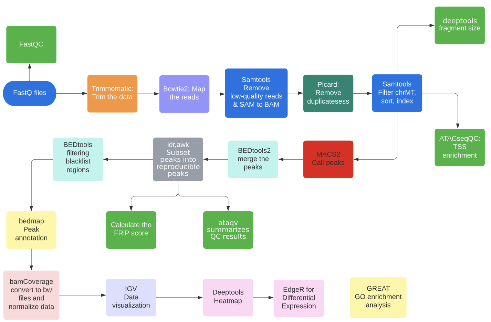

## Acquiring Raw Data Online

The original study acquires the mouse lens samples by dissecting the mouse lens epithelium and fibers. They then follow ATAC-seq protocol by treating the samples with transposase at 37°C for 30 min to prepare for ATAC-seq analysis. The ATAC-seq library was used for 75-bp paired-end sequencing on Illumina NextSeq 500. We follow the original study and assume that 75-bp is a good base pair length, since small sequence length could result in many ambiguously mapped reads (reads map to several sites in the genome) and a long sequence length could result in finding less uniquely mapped reads. In Figure 1, the ATAC-seq data processing steps are described as a flowchart and the green boxes represent quality controls. The data was downloaded from the European Nucleotide Archive (ENA): https://www.ebi.ac.uk/ena/browser/home. 

### Initial Quality Control: Fast QC

Like any sequencing analysis, our first workflow step is to ensure the quality of our reads before aligning them to the reference genome. We use the FastQC library to import our reads which is in fastq format and plot their quality scores. This allows us to quickly assess our reads quality in HTML. Figure 2 shows per base sequence quality of sample SRR8380074. The plot shows that all of the reads are in good quality with phred scores above 25 (99% accuracy). The only test that failed was the per base sequence quality. We deduct this is due to transposase-5 (Tn5) sequence bias as Tn5 is used to cleave chromatin and insert sequencing adapters. To avoid redundant graphs, we only include the SRR8380074 fastqc result, but all other samples have equal or very similar qualities. Since we have good quality for our reads, we proceed to ATAC-seq analysis.

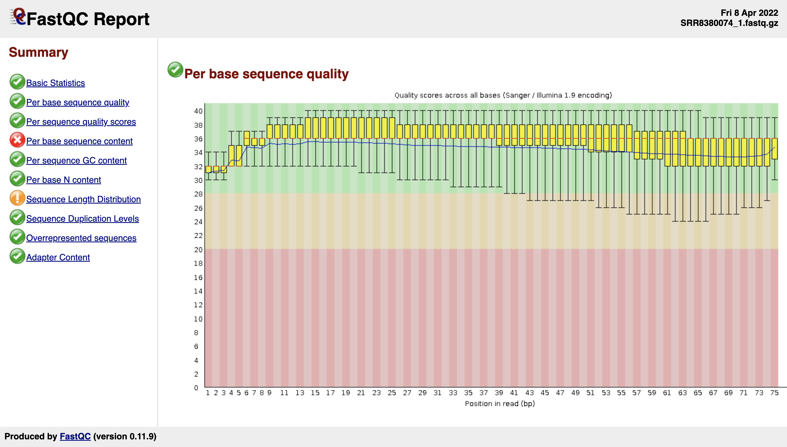

## ATAC-seq Data Analysis

The 75-bp paired-end ATAC-seq reads are trimmed by trimmomatic (v 0.39) to remove adaptors. Trimming adaptor sequences filters out low sequencing quality which helps for aligners to achieve a better read mapping result. An aligner library Bowtie2 (v 2.3.4.2) is used to map the trimmed reads to the mouse reference genome (mm10). The mapped reads are then filtered for mitochondrial, duplicated reads, and mm10 blacklist regions through SAMtools (v 1.2), picard (v 2.27.1), and bedtools2 (v 2.26.0). Mitochondrial regions are filtered out as they are common contaminant of ATAC-seq data. Then, MACS2 (v 2.1.0) is used to call and merge peaks and the peaks. Lastly, we can identify how many non-redundant ATAC-seq peaks exist in our sample.

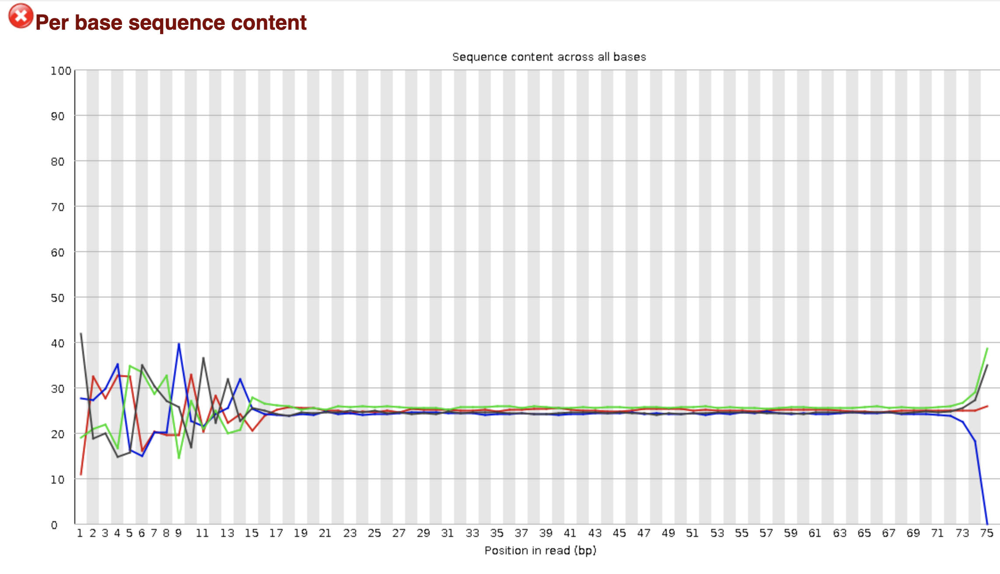

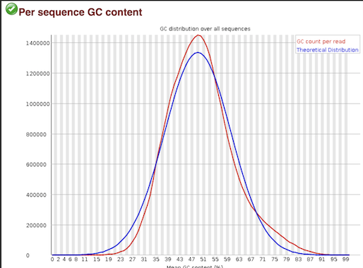

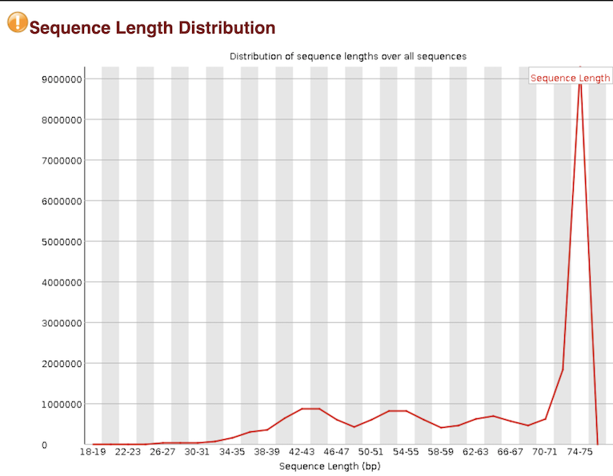

### Quality Control: Deeptools Fragment Size

We then do quality control on our SAM/BAM files by calculating the fragment sizes. This is because the fragment size is very sensitive to the concentration of the sample's DNA and the variation of fragment sizes is often large. Since alignment libraries like bowtie2 uses overlapping paired end reads to produce longer continuous sequences (75 bp + ~100 unsequenced bp + 75 bp). Small fragment sizes would mean fewer long reads which could result in the presence of adapter at the end of the read despite trimming. We can use bamPEFragmentSize to check if our paired-end samples have fragment sizes long enough for this possibility to be minimized. This module in particular summarizes the statistic of the reads. Drawing from the results below, our framgment length had a mean of 105.65 bp, which is about the same size of our unsequenced bp. This shows that the adapter regions have been successfully trimmed and therefore passes the quality check. Our calculated TSS score was 13.7, which is above the ideal condition of TSS score 7, hence passes our quality check.

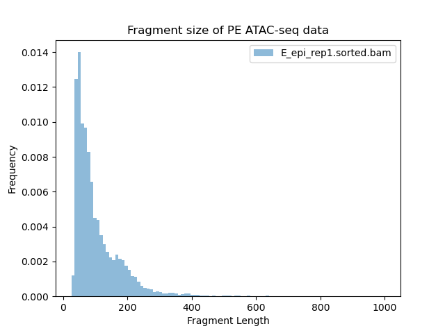

### Quality Control: TSS Enrichment

Transcription Start Site (TSS) Enrichment Score is a signal to noise ratio used to evaluate ATAC-seq. The signal (desired signal) represents the combined distributions of reads centered on the reference TSSs and the noise (background noise) represents the distributions of reads flanking/next to the reference TSSs. A typical TSS score vs distance to TSS plot would have a peak in the middle with high TSS scores at transcription start sites (highly open regions of the genome) [3]. The center signal value is our TSS enrichment metric used to evaluate ATAC-seq. Additionally, we split the reads into nucleosome free, mononucleosome, dinucleosome, and trinucleosome and discard the rest, as these reads are most usable and unbiased for interpreting functional dynamic of nucleosomes.

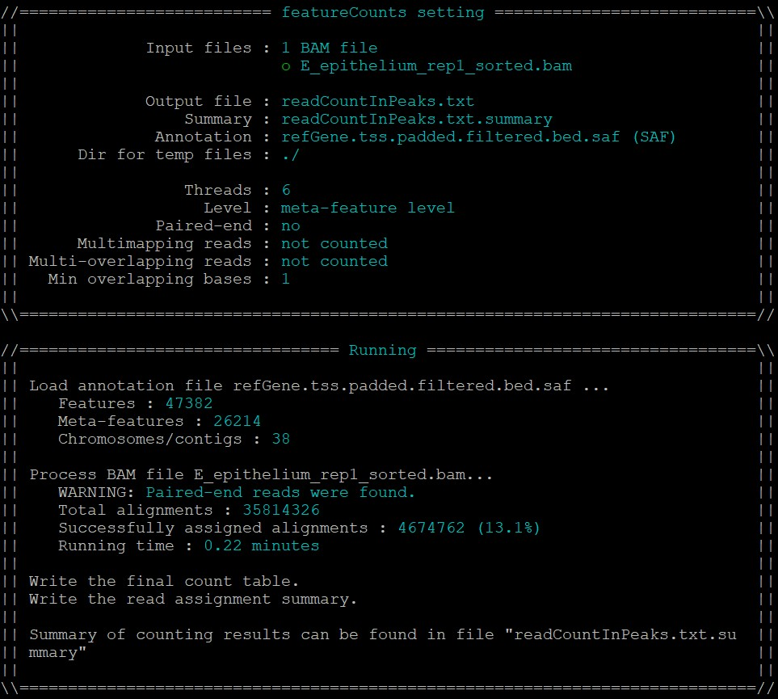
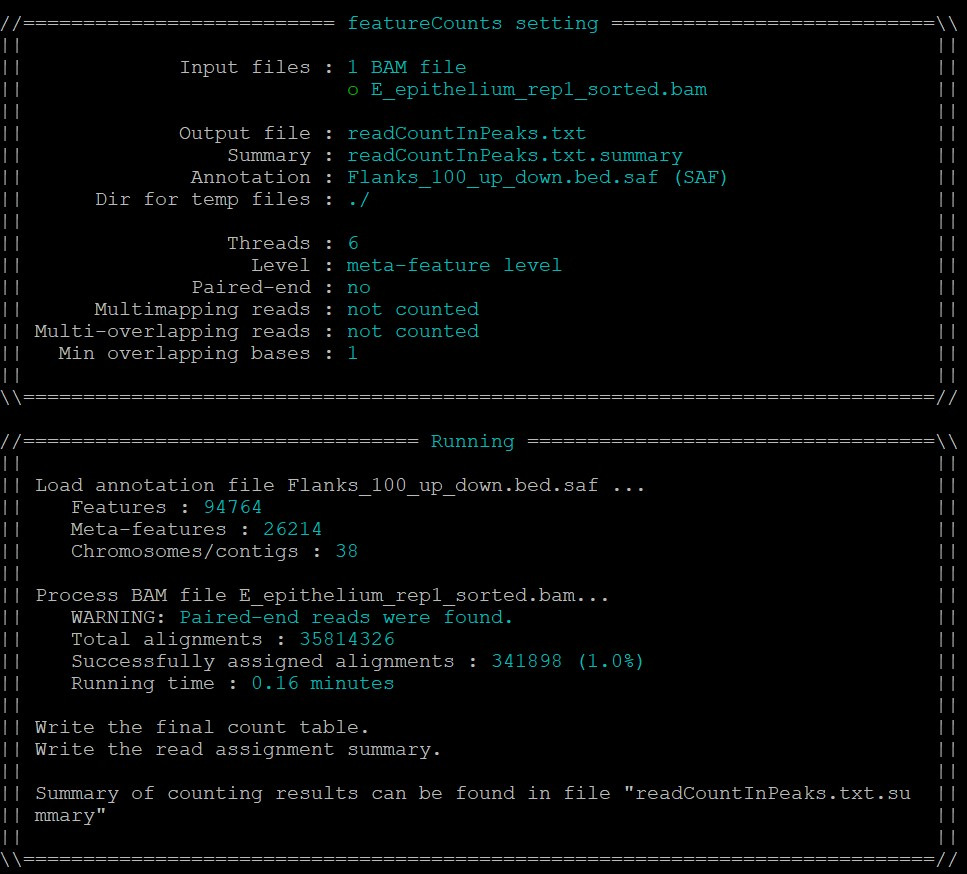

### Quality Control: ATACseqQC

Alternatively, we can calculate the TSS enrichment score (the degree to which transcription start sites show enrichment for ATAC-seq reads) using ATACseqQC. Using ATACseqQC gives us a more hollistic overview of our data because we can get additional information such as the library complexity, nucleosome positioning, PT score, and NFR score. 

#### Library Complexity
The library complexity is the number of unique DNA fragments present in our bam file. A small complexity, which typically results from PCR amplification, will counteract against downstream analysis because the number of duplicate reads is too high. Additionally, the nucleosome positioning is important for downstream analysis, because downstream analysis requires peak-called reads in bamfiles to be shifted. This is because Tn5 transposase inserts two adaptors into accessible DNA locations separated by 9 bp. From our results below, our library complexity shows a cumulative distribution when plotting putative sequence fragments against distinct fragments. Since high reads indicate distinct fragments, this passes our quality check. 
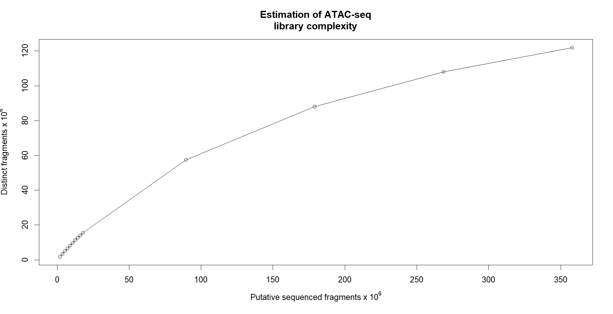

#### Promoter/Transcript body score (PT Score)

The PT score calculates the coverage of promoter divided by the coverage of its transcript body. The PT score shows if the signal is enriched in promoters. The promoter sequences dictates where the transcription of DNA sequences starts. The log2 mean coverage depth is an average of coverage depths for the corresponding bin at each sample. A positive PT score (y-axis) indicates a transcript region, and a negative PT score indicates a promoter region. Since the coverage for these values appear symmetric, our data passes the PT quality check since promoter sequences are expected to be very near the transcript body.

#### Nucleosome Free Regions (NFR) score

NFR score is a ratio between TSS and its flanking TSS signals. The NFR score for each TSS is log2(nf) - log2((n1+n2)/2) where n1 is the most upstream 150 bp, n2 is the most downstream of 150 bp, and nf is the middle 100 bp. Comparing our NFT plot to the PT plot, we see similar coverage and the NFR score is subdivided into subregions as expected. The NFR plot is meant to reflect similarly to the MA plot for gene expression data, and our plot reflects the same result. Hence, our data passes the NFR quality check. 

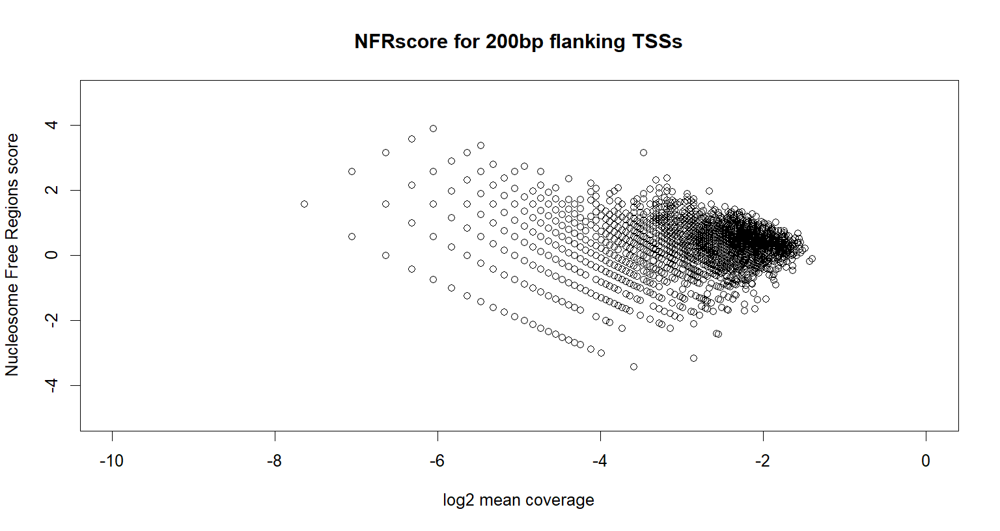

#### TSS Enrichment Score

As already calculated from above, we know that our TSS score is in ideal condition. However, ATACseqQC library allows us to view the full distribution of our TSS scores. This distribution takes the signal value at the center of the distribution after TSS normalization as our TSS metric. Since the flanking TSS scores drop away from the peak, our data reflects the quality check as expected. 

#### Heatmap and Coverage Curve for Nucleosome Positions

A normal coverage curve for mononucleosome positions would have a high peak at 0.99 and a sharp drop anything below 0.99. A normal heatmap would have heavy concentration at the middle region of the nucleosome free heatmap and almost no/equal signals of low concentration for the mononucleosome heatmap. This is because we enriched nucleosome-free fragments at the TSS region, so we should observe a conentration of signals near the TSS region (near the middle region of the nucleosome free heatmap). We expect this since we averaged the signals across all active TSSs. For the mononucleosome heatmap, we enriched both upstream and downstream of the active TSSs so it should display almost no/equal signals of low concentration everywhere. Since our heatmap matches both descriptions, it passes our quality check. Additinoally for the coverage curve for nucleosome positions, because ATAC-seq reads are concentrated at regions of open chromatin, we should see a strong nucleosome signal at the +1 nucleosome. We also see that for our coverage curve for nucleosome positions, hence our data passes the quality check.

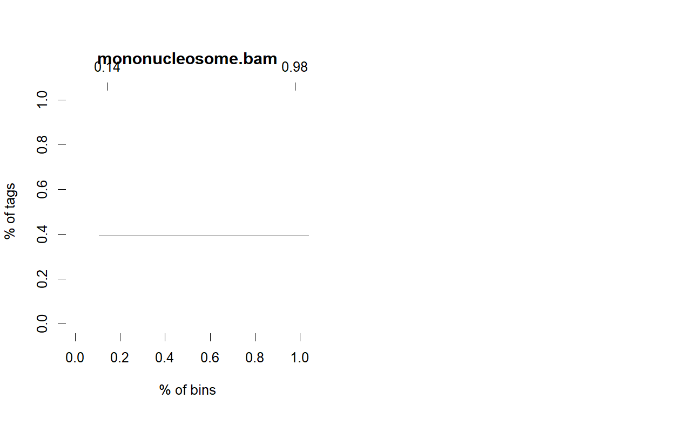
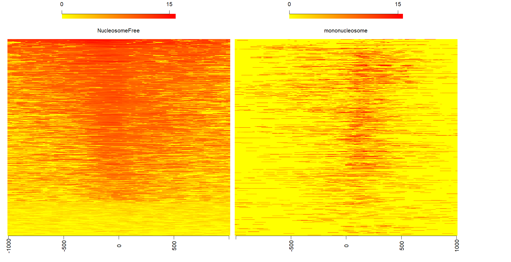
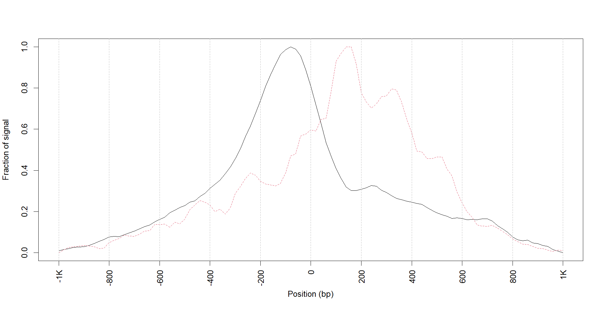

#### Plot Footprints and Feature Aligned Heatmap

The factorFootprints function predicts the binding sites using the input position weight matrix (PWM) to calculate and plot the accumulated coverage of those binding sites. It shows the status of the occupancy genome-wide, which is important since ATAC-seq footprints are factor occpupancy genome-wide (fraction of time for which a location is occupied by). The cut-site probability is very low when distance to motif is almost 0. This plot is a straightforward visualization of the characteristics of our sample.  

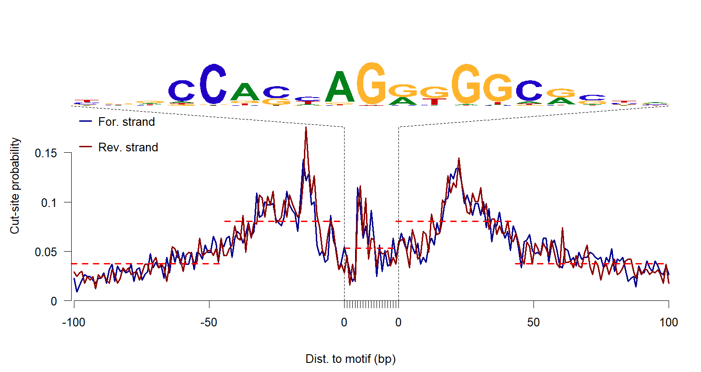
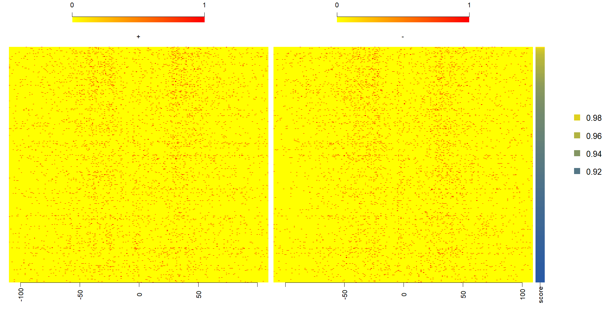

#### V-plot

V-plot is a plot that visualizes fragment midpoint vs length for a given transcription factors. Since our sample represents a sampling distribution, the distinction of the V is barely visible. The true population dataset would show a much more distinct V shape in the plot which reveals chromatin features of transcription binding sites. The dots represent the midpoint of each paired-end fragment. The Y-axis represents its length and the x-axis represents the distance of its midpoint from the center of the genomic feature. The V-shape comes from the left diagonal line which is the fragments cleaved precisely to the right of the transcription-protected region (chromatin closed regions). The vice versa is also true, which gives this left and right diagonal shape to form a V.

## Analysis Continues: Calling Peaks

After all quality checks are done, we call the peaks on our reads to identify areas that have been enriched with aligned reads. 

### Quality Control After Calling Peaks: FriP score

Fraction of reads in peaks (FRiP) is a ratio of usable reads in significantly enriched peaks to all usable reads. In other words, it is a fraction of mapped reads that fall into the called peak region [3]. FRiP scores are often used as a measure of ChIP-seq quality. A high FriP score is benefitial since that means we have a lot of usable reads.

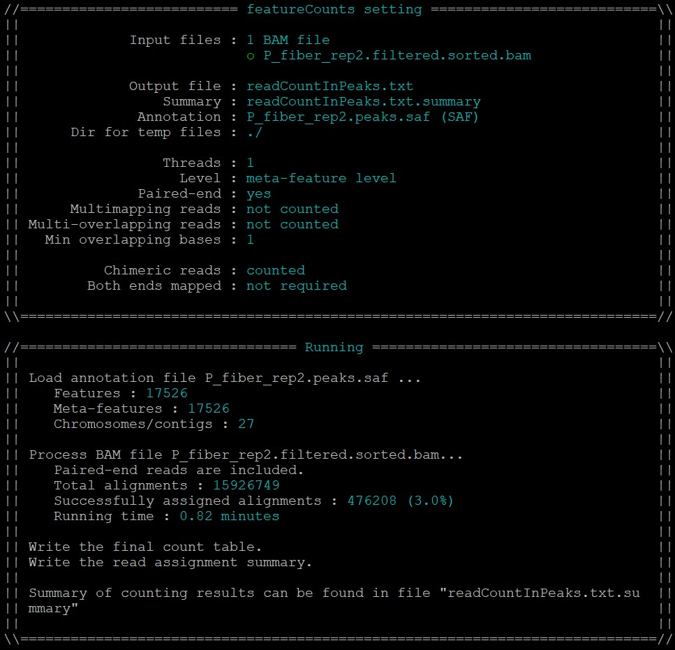

### Quality Control: ATAQV

ATAQV is used for ATAC-seq quality control and visualization. It is a tool for comparing ATAC-seq results by finding differences that may have been caused by library prep or sequencing. Some useful metrics include mapping quality, reads napped in proper pairs, PCR duplicates, and reads mapping to mitochondrial references. We use this tool to summarize all these quality control results into a interactive HTML page, which allows the reader to view multiple samples together.

## Data visualization

The University of California Santa Cruz (UCSC) genome browser (genome.ucsc.edu) is a web-based tool for annotating regions of genomes, or in our case for annotating peaks. Our peaks were associated with genes in the Refseq annotation downloaded from the UCSC genome browser. The peaks were annotated with default parameters (-3kb to +3kb from TSS). Then, Integrative Genomics Viewer (IGV, v 2.4.7) was used to visualize our annotated ATAC-seq peaks. The data was normalized to the same sequencing depth and deepTools2 (v 2.5.2) was used to plot the heat maps to show signals around peak regions with default parameters. The HTseq (ver 0.8.0) library was used to calculated read pair numbers for each peak and the EdgeR (v 3.22.3) library was used to identify differentially acecssible regions (DARs) with the cutoff CPM>2, FC>2, and FDR<0.05. We should note that a peak could be present in multiple DARs if its signal changes met this criterion Lastly, four clusters were selected from the unique and shared peaks using bedtools (v 2.23.0) to delineate unique peaks from each cell type and age. 

### IGV comparison between E_epithelium_rep1, P_epithelium_rep1 and P_fiber_rep1 data

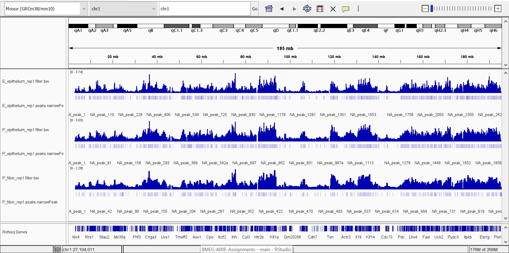
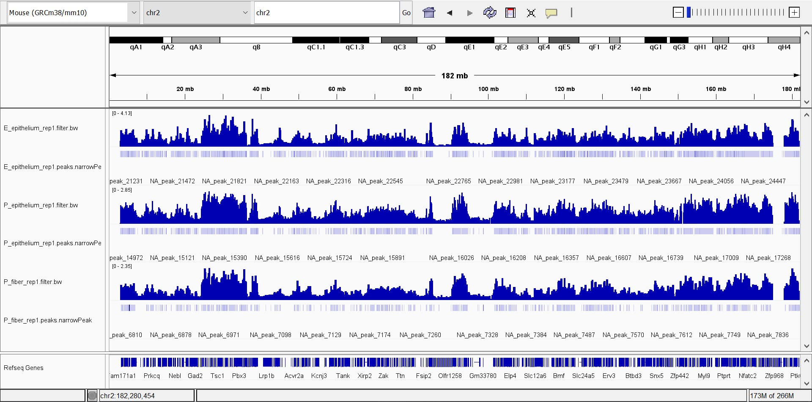
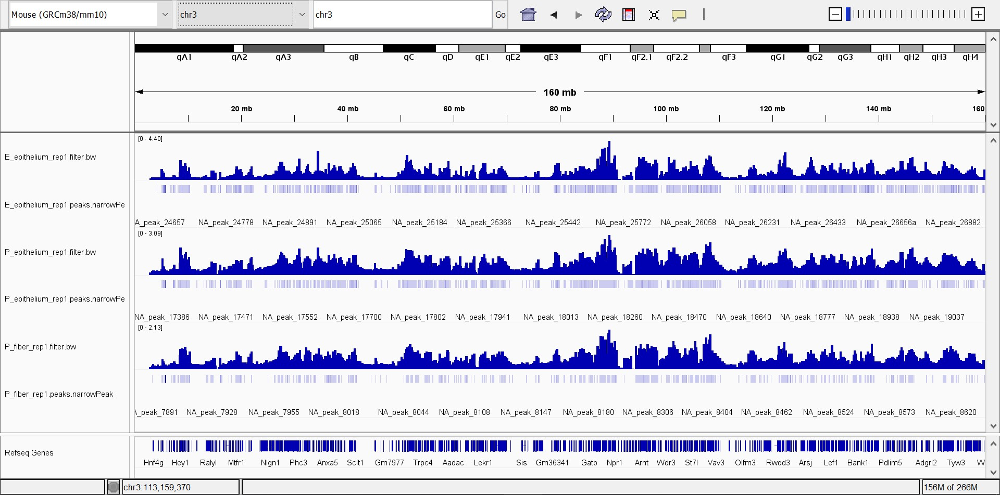
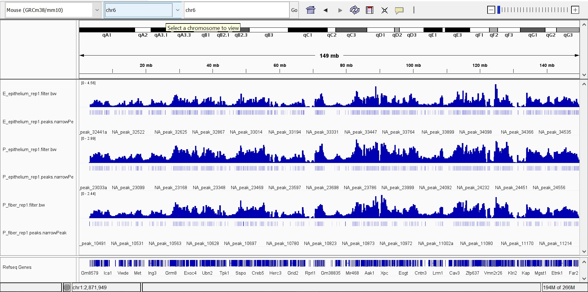
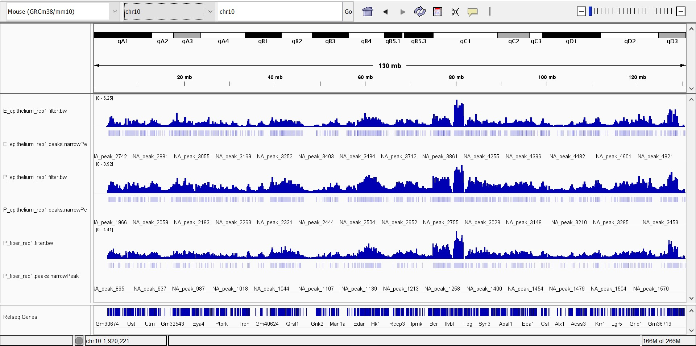
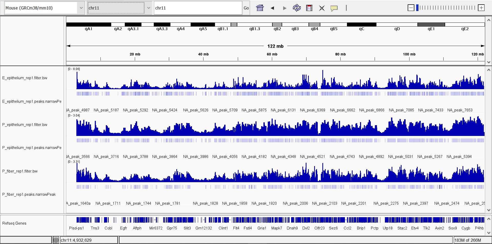
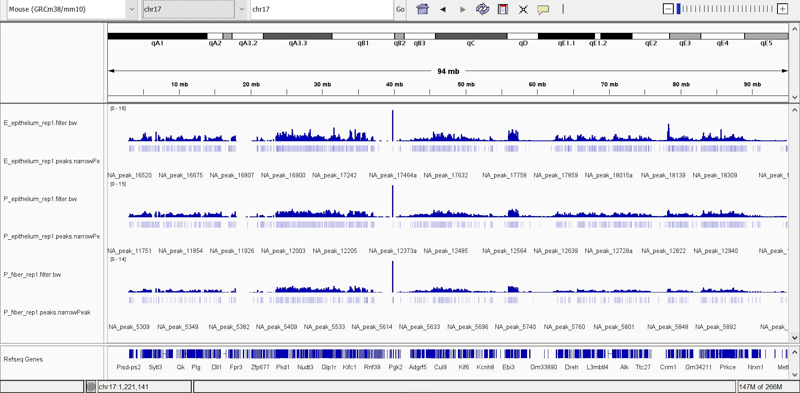
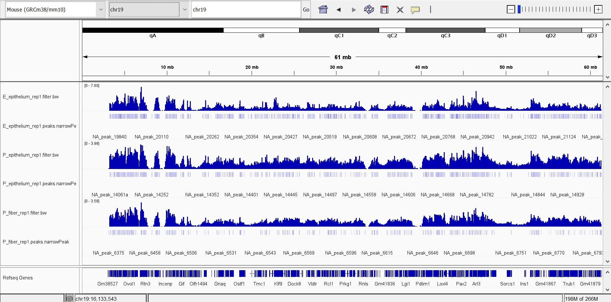

### Differential Expression of Genes

Genes with larger average expression have on average larger observed variances across samples. This means the genes have different scatter because the genes with larger average expression vary in expression from sample to sample more than genes with lower average expression. We can observe this relationship from the figures below, but we should note that the logarithmic transformations creates a margin of error by over-adjusting so that large log-counts have smaller scatter than small log-counts. Additionally, scatter tends to get smaller as we increase the number of replicates. This is because standard deviations of averages are smaller than standard deviations of individual observations. Hence, if we were to have more replicates than our current amount of 2, then we would produce more accurate estimates of group means. 

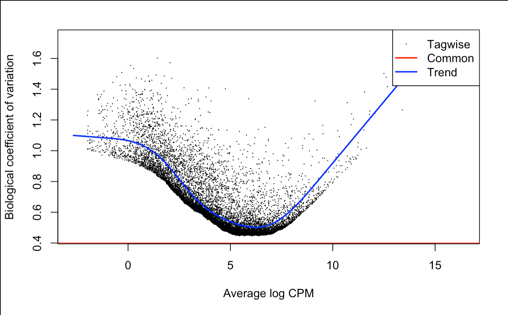
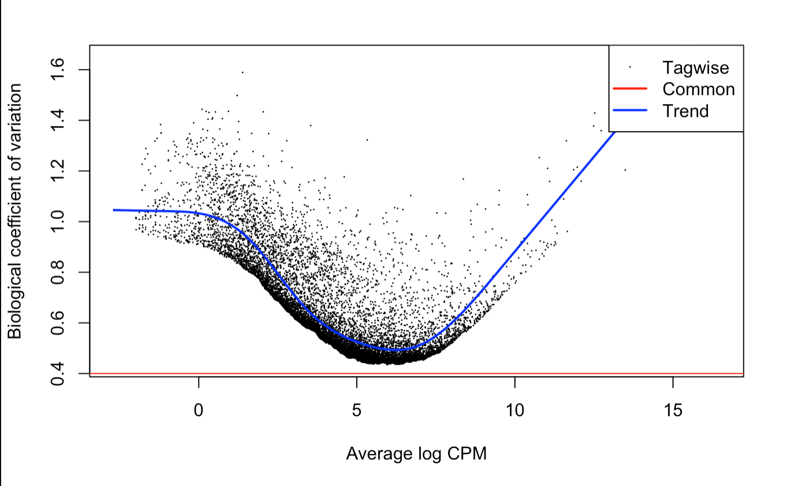

To gain a better understanding of the variance of our selected genes, we plot mean vs variance here as the average log CPM is the mean expression value plotted against the coefficient of variation. In the code above using edgeR, a common dispersion is estimated for all the tags and then the tagwise dispersions are squeezed towards the common or trended dispersion. The trend and common lines tells us the magnitude of the dispersions before it estimates the tagwise values. Biological CV (BCV) is the coefficient of variation with the true abundance of the gene varying between replicate RNA samples (Dispersion estimates = BCV squared). The BCV value is the percentage of variation observed in the true abundance of a gene between replicates. Our common BCV was 0.60 which would indicate that the true abundance for a gene can vary by 60% up or down between replicates. In our plot, we see that the scatter in the two replicate datasets for tag-wise estimates is large for low expressor genes, and BCV values range very high.

So far we have calculated the count data, obtained sample grou information, normalized factors for each sample, and calculated dispersion estimates. For the next step, we will set the threshold of FDR < 0.05 to select genes as siginificantly differentially expressed between the samples. 

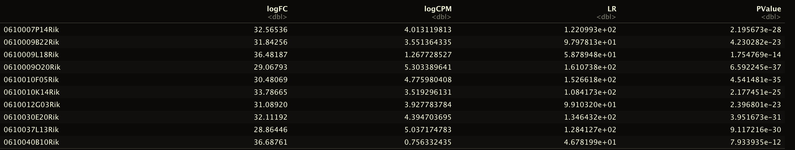

## Identification of DARS from DEGS

The differentially expressed genes (DEGS) were obtained from E14.5 and P0.5 lens RNA-seq data at FDR<0.05 to select genes that were most differentially expressed. Then, differentially accessible regions (DARS) at DEGS with similar ATAC-seq signals were combined for lens cells differentiation to determine the lens epithelium maturation path represented by the DARs from E14.5 fibers vs P0.5 epithelium. 

# Conclusion

Unfortunately, we were not able to finish our data analysis due to server memory overhead causing a lot of our analysis to fail. However, we were able to infer that our data had very high quality, passing multiple quality checks from fastqc, PT score, TSS enrichment score, NRT score, and more. Additionally, we were able to determine the most differentially expressed genes, which did share many similarities from the paper, but we had an overwhelming amount of more genes expressed.  

# References

[1] Zhao, Y., Zheng, D., & Cvekl, A. (2019). Profiling of chromatin accessibility and identification of general cis-regulatory mechanisms that control two ocular lens differentiation pathways. Epigenetics & Chromatin, 12(1). https://doi.org/10.1186/s13072-019-0272-y 

[2] Sam/BAM Quality Control: Analyzing Short Read Quality (after mapping). BaRC. (n.d.). Retrieved April 9, 2022, from http://barcwiki.wi.mit.edu/wiki/SOPs/SAMBAMqc

[3] Terms and definitions. ENCODE. (n.d.). Retrieved April 9, 2022, from https://www.encodeproject.org/data-standards/terms/#enrichment 
